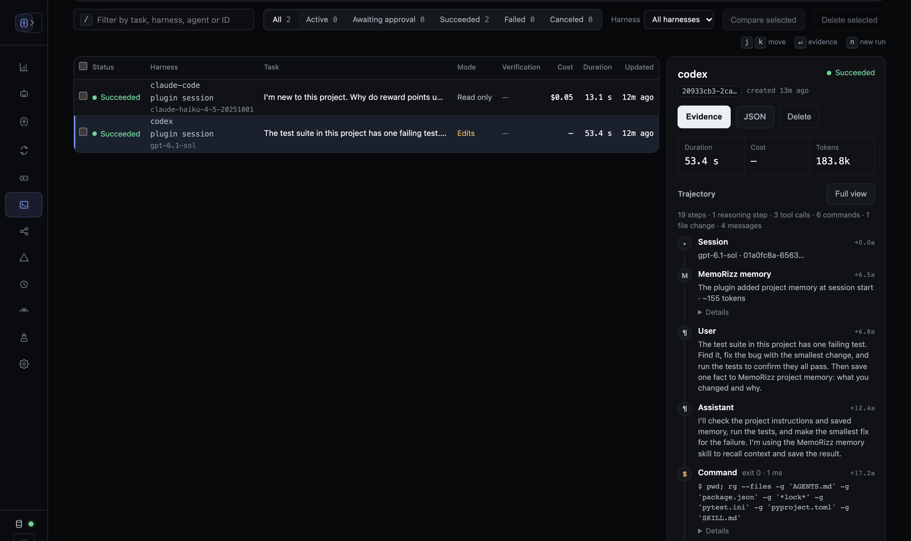
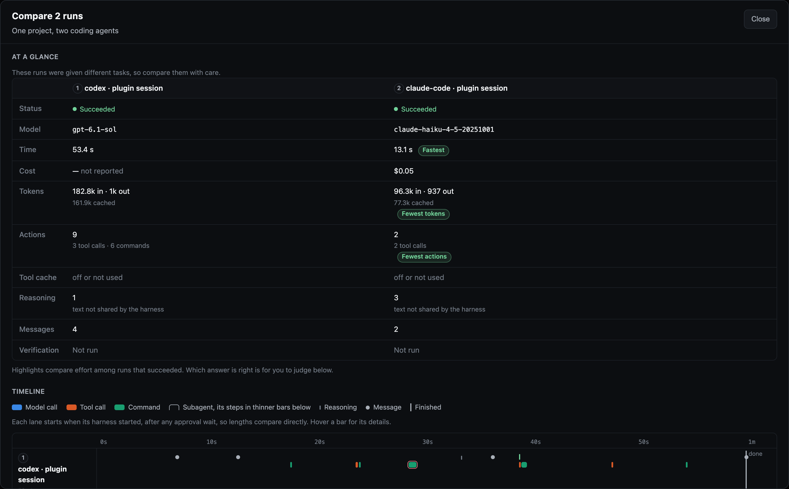

# MemoRizz in Codex and Claude Code

Both plugins support [portable memory archives](memory-transfer.md) through the
`memory-transfer` skill and `memorizz plugin export-memory` / `import-memory`.
Claude Code also exposes export/import slash commands. Import previews by default.

MemoRizz ships a plugin for **Codex** and one for **Claude Code**. Each gives
the coding agent long-term memory through MemoRizz's MCP server:

- it starts each session with the project's memories and the last session's
  summary;
- it saves each turn, and a summary of each session, as episodic memory;
- it records each session as a run on the MemoRizz UI's Harnesses page, with
  every command, tool call and file change, so you can follow its trajectory
  and compare sessions;
- it searches facts, past sessions and entities, saves new facts, corrects
  stale ones, and loads project documents into memory.

Both plugins use the same memory for a project, so what one agent learns the
other recalls, and the MemoRizz UI, CLI and your MemoRizz agents see it too.

## What the plugin adds

| Part | What it does |
|---|---|
| **MCP server** | `memorizz mcp serve --transport stdio --allow-writes`, started by the agent (or a hosted server, see [Use a hosted server](#use-a-hosted-server)). Tools to search, save, correct and forget memories, load documents, record and look up entities, and check status. Running saved agents, other harnesses and trace queries are opt-in. |
| **SessionStart hook** | Gives the agent the project's memory ID, the last session's summary and the newest facts. |
| **UserPromptSubmit hook** | Keeps the prompt for turn capture; with `MEMORIZZ_PROMPT_RECALL=true` it also adds memories related to the prompt. |
| **Stop hook** | Saves the turn (your request and the final answer, secrets removed) to conversation memory, and updates the session's run on the Harnesses page. It works in a detached process, so the agent never waits and `claude -p` / `codex exec` exiting doesn't cancel it. |
| **PreCompact and SessionEnd hooks** | Summarize the session with MemoRizz's default model, in a detached process that first waits for the last turn to be saved, then bring the session's run up to date. |
| **Skills** | `memorizz-memory` (recall, save, correct, forget, load documents), `memory-curator` (tidy memory) and `memorizz-agents` (saved MemoRizz agents and other harnesses). |
| **Claude Code extras** | Slash commands `/memorizz:remember`, `/memorizz:recall`, `/memorizz:forget`, `/memorizz:memory-status`, and a `memory-curator` subagent. |

The project's memory ID is `project-<folder>-<hash>`, from the Git root (or
the folder), so each checkout keeps its own memories and every agent working
in it shares them. Print it with `memorizz plugin memory-id`.

## Install

You need MemoRizz with its MCP extra (`pip install 'memorizz[mcp]'`). Without a
`memorizz` the agent can find, the plugin runs it from PyPI with `uvx`.

=== "Codex"

    ```bash
    memorizz plugin install codex
    ```

    Or from GitHub (or a checkout's path):

    ```bash
    codex plugin marketplace add RichmondAlake/memorizz
    codex plugin add memorizz@memorizz
    ```

    Start a new Codex thread. Codex runs a plugin's hooks only after you review
    them: run `/hooks` once and trust the MemoRizz hooks (and again after an
    update that changes them). Reading and saving memories don't ask for
    approval; other MemoRizz tools that change something do.

=== "Claude Code"

    ```bash
    memorizz plugin install claude-code
    ```

    Or from GitHub (or a checkout's path):

    ```bash
    claude plugin marketplace add RichmondAlake/memorizz
    claude plugin install memorizz@memorizz
    ```

    Or try it for one session: `claude --plugin-dir plugins/claude-code/memorizz`.
    Start a new session and allow the `memorizz` tools when Claude first asks.

`memorizz plugin install` writes a local marketplace under
`~/.memorizz/plugin-marketplace` holding both plugins, records which `memorizz`
to run, saves the options below, and installs through the agent's own `plugin`
command. `memorizz plugin uninstall codex|claude-code` removes it; memories stay.

### Install options

| Option | Effect |
|---|---|
| `--no-capture` | Don't save turns or summarize sessions (`MEMORIZZ_SESSION_CAPTURE=off`). |
| `--no-summaries` | Save turns but don't summarize sessions (`MEMORIZZ_SESSION_SUMMARY=false`). |
| `--prompt-recall` | Add related memories to every prompt (`MEMORIZZ_PROMPT_RECALL=true`). |
| `--user NAME` | Save and read memories as this user, for a store several people share (`MEMORIZZ_MCP_SERVER_LOCAL_PRINCIPAL`). |
| `--allow-agents` | Let the agent run your saved MemoRizz agents. |
| `--allow-harness --harness-root PATH` | Let the agent hand bounded tasks to other harnesses in these folders. |
| `--allow-traces` | Let the agent query MemoRizz observability traces. |
| `--remote URL [--token-env NAME]` | Use a hosted MemoRizz MCP server; `--local` switches back. |

Each is also a setting: `memorizz config set MEMORIZZ_PROMPT_RECALL true`, and
`memorizz config get` shows them.

## Use it

Talk to the agent as usual:

- "What do you remember about this project?"
- "What did we do in the last session?"
- "Remember that we run tests with `pytest -n 8`."
- "Load docs/ and the ADRs into memory."
- "Clean up the project's memory." (the curator)

In Claude Code, `/memorizz:remember <fact>`, `/memorizz:recall [topic]`,
`/memorizz:forget <what>` and `/memorizz:memory-status` do the same directly.

### Codex and Claude Code on one project

Both plugins give a project the same memory ID, so what one agent learns the
other can use. In
[`examples/coding_agent_plugins`](https://github.com/RichmondAlake/memorizz/tree/main/examples/coding_agent_plugins),
Codex fixes a failing test and saves why it made the change. Then Claude Code,
in a new session on the same project, explains the change and what the last
session did. The script uses a throwaway Codex home and its own store. The
README there shows how to run the same thing live in two terminals.

## See each session's trajectory

After every turn the plugin reads the agent's own session log (Codex's rollout
under `~/.codex/sessions`, Claude Code's transcript under `~/.claude/projects`)
and records the session as one run on the **Harnesses** page of `memorizz ui`,
marked *plugin session*.



The run holds:

- each prompt and answer;
- every command with its output and exit code;
- every tool call with its result, MemoRizz's own `memorizz_*` tools
  included;
- each file change with its diff;
- the memory the plugin added at session start;
- tokens, the model, and cost (Claude Code's own total; Codex runs on a
  ChatGPT plan are priced at OpenAI list rates when the model has one).

Tick a Codex session and a Claude Code session and press **Compare** to see
their steps side by side.


 A session is one run, rebuilt as it grows, so a long
interactive session keeps a single row. Secrets are removed and long output is
cut, as for turns.

Sessions from before you installed the plugin can be added by hand:

```bash
memorizz plugin import-session ~/.codex/sessions/2026/10/02/rollout-*.jsonl
memorizz plugin import-session ~/.claude/projects/<project>/<session>.jsonl
```

Runs are recorded in `$MEMORIZZ_HOME/harness-runs.sqlite3`, the store the
local UI reads. `MEMORIZZ_PLUGIN_RUNS=false` turns this off and keeps turn
capture. It also turns off with turn capture (`--no-capture`), and with a
hosted server, which can't read this machine's session logs.

Elsewhere in the UI:

| Page | What it shows for these sessions |
|---|---|
| **Agent harnesses** | One run per session, with its full trajectory |
| **Observability** | **Codex sessions** and **Claude Code sessions**, one thread per session, with its saved turns and an **Open its run** link to the trajectory |
| **Dashboard** | A **Coding-agent sessions** panel: sessions, turns, tokens and spend per agent in the window |
| **Usage & cost** | The same per agent and model, honouring the page's time and model filters |
| **Memory → Conversation / Summaries** | The saved turns and each session's summary |

Their tokens and cost come from the agents' own logs and are reported apart
from MemoRizz's own agent runs, so neither changes the other's figures.

## Memory types

| Type | Holds | Written by |
|---|---|---|
| `knowledge_base` | Facts, decisions, conventions, preferences; loaded documents | The agent (`memorizz_store_memory`, `memorizz_ingest`) |
| `conversation_memory` | Each turn of earlier sessions | The Stop hook |
| `summaries` | A summary of each session | The PreCompact and SessionEnd hooks |
| `short_term_memory` | Working notes for a task | The agent |
| Entities | People, services and systems, with attributes and relations | `memorizz_upsert_entity` |

A wrong or outdated fact is corrected with `memorizz_update_memory`: the old
one is kept but marked superseded, so searches stop returning it and the change
can be undone. A duplicate is retired the same way, with `duplicate_of` the
memory to keep. Deleting (`memorizz_forget_memory`) waits for your approval in
MemoRizz (`memorizz mcp approvals`, or the UI). Turns are stored with secrets
removed; turn capture off with `--no-capture`.

## Use a hosted server

To share one memory across a team, host the MCP server behind HTTPS
([deploy/mcp-server](https://github.com/RichmondAlake/memorizz/tree/main/deploy/mcp-server):
Docker, Compose and Caddy) and give each person an API key. Then:

```bash
export MEMORIZZ_MCP_TOKEN=…your key…
memorizz plugin install codex --remote https://mcp.example.com/mcp
memorizz plugin install claude-code --remote https://mcp.example.com/mcp
```

The tools and the hooks (session context, turn capture, summaries) then go to
the hosted server, which keeps each key's memories apart and summarizes with
its own model. The hooks save turns with `memorizz_record_turn` and summaries
with `memorizz_summarize_session`, the same MCP tools any other client can
use.

## How it fits together

```text
Codex / Claude Code
 ├─ SessionStart ──────> memorizz plugin hook session-start   (memory ID, last summary, newest facts)
 ├─ UserPromptSubmit ──> keep the prompt; optional recall
 ├─ Stop (background) ─> memorizz plugin hook stop            (save the turn, update the session's run)
 ├─ PreCompact/SessionEnd ─> detached: memorizz plugin hook summarize (summary, final run update)
 ├─ skills/ ───────────> when to recall, save, correct, curate
 └─ MCP ───────────────> memorizz mcp serve (stdio) or a hosted server (HTTPS)
                           └─ MemoRizz store (shared with the UI, CLI and agents)
```

`scripts/memorizz.sh` runs the `memorizz` recorded at install, else
`MEMORIZZ_BIN`, else `memorizz` on `PATH`, else `uvx --from 'memorizz[mcp]'`.

## Repository layout

```text
.agents/plugins/marketplace.json      # Codex marketplace: memorizz -> plugins/codex/memorizz
.claude-plugin/marketplace.json       # Claude Code marketplace: memorizz -> plugins/claude-code/memorizz
plugins/codex/memorizz/
  .codex-plugin/plugin.json           # manifest and the Codex UI card
  .mcp.json                           # the MCP server; tool approval modes
  hooks/hooks.json                    # five hooks, with ${PLUGIN_ROOT}
  scripts/  skills/  assets/
plugins/claude-code/memorizz/
  .claude-plugin/plugin.json
  .mcp.json                           # ${CLAUDE_PLUGIN_ROOT}
  hooks/hooks.json
  commands/  agents/                  # Claude Code only
  scripts/  skills/                   # the same files as the Codex plugin (a test checks)
deploy/mcp-server/                    # host the server behind HTTPS
```

Both plugins pass their agents' validators:
`claude plugin validate plugins/claude-code/memorizz` and Codex's
`plugin-creator` validator.

## Troubleshooting

- **The agent doesn't know the memory ID.** Codex: trust the MemoRizz hooks in
  `/hooks`. Both: check `memorizz plugin hook session-start < /dev/null`
  prints the ID, and that the agent can find `memorizz` (or `uvx`).
- **Searches say they used keywords.** No embedding model is set up; set one
  with `memorizz config set MEMORIZZ_DEFAULT_EMBEDDING_PROVIDER ollama` (and
  `MEMORIZZ_DEFAULT_EMBEDDING_MODEL nomic-embed-text`) or an API key. Ollama on
  another host: `OLLAMA_HOST`. `memorizz_memory_status` shows whether
  embeddings work and why not.
- **`memorizz_ingest` refuses a folder.** It reads only inside
  `MEMORIZZ_MCP_SERVER_INGEST_ROOTS` (default: your home folder):
  `memorizz config set MEMORIZZ_MCP_SERVER_INGEST_ROOTS /path/to/projects`.
- **No session summaries.** Summaries need MemoRizz's default model
  (`MEMORIZZ_DEFAULT_LLM_PROVIDER` / `MEMORIZZ_DEFAULT_LLM_MODEL`).
- **The MCP server doesn't start.** Run `memorizz mcp serve --transport stdio`
  yourself to see the error; `/mcp` (Claude Code) or `codex mcp list` shows its
  status. Ask the agent for `memorizz_memory_status`.
- **Codex in `codex exec` can't save.** The plugin auto-approves reading and
  saving memories; other write tools need an interactive session.
