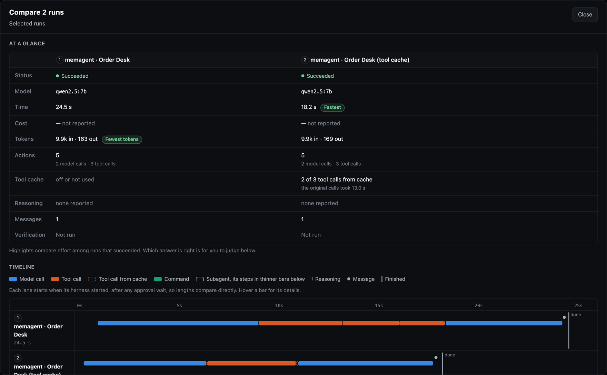
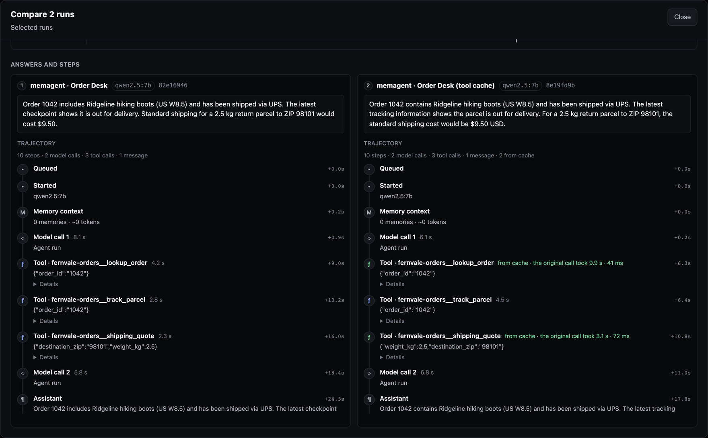

# Context Efficiency & Prompt Caching

MemoRizz assembles every agent turn to be **prompt-cache friendly** and
**deduplicated**, so multi-turn conversations and tool loops are billed at
each provider's cached-input rate instead of full price, and the model never
pays twice for the same memory.

## The prompt layout

Prompt caching (OpenAI and Anthropic alike) is a **byte-exact prefix match**:
the first changed byte invalidates the cache for everything after it.
MemoRizz therefore orders every request stable-prefix → volatile-tail:

```
┌─────────────────────────────────────────────────────────────┐
│ tools           sorted; disclosed tools stay visible        │  stable
│ system prompt   frozen for the session                      │  prefix
│ history         append-only, chunk-evicted                  │  (cached)
├─────────────────────────────────────────────────────────────┤
│ final user message                                          │  volatile
│   <memorizz:context>                                        │  tail
│     retrieved memories (deduplicated)                       │  (never
│     entity memory facts                                     │  cached,
│     tool-log digest                                         │  never
│     per-call request context                                │  breaks
│   </memorizz:context>                                       │  the
│   the user's query                                          │  prefix)
└─────────────────────────────────────────────────────────────┘
```

Everything that changes per turn — retrieved memories, entity facts, the
tool-log digest, the M2 `context={...}` request payload — is rendered into
the **final user message**, where it can't invalidate the cached prefix.
The volatile block is never persisted to `conversation_memory`; only the raw
query is recorded.

### Append-only history with chunked eviction

Instead of recomputing a token-fitted history window every turn (which moves
the window start every turn and breaks the prefix), MemoRizz evicts history
in chunks of 20 messages: the window start stays byte-stable for many turns,
then jumps a whole chunk at once — one cache miss per chunk instead of one
per turn.

### A stable tool surface

Tool schemas are the first bytes of the cached prefix, so any change to the
exposed tool list rewrites everything after it. Progressive disclosure picks
the most relevant tools for each query, which would change the list almost
every turn. Tools already disclosed to an agent's user therefore stay
visible (and callable), up to `ContextPolicy.sticky_tool_limit` (default 15);
past the bound the least recently selected tool is evicted. The list changes
only when a genuinely new tool is needed, and the converged surface is shared
by every conversation with the agent. Set `sticky_tool_limit=0` to re-select
every turn.

Even sticky tools change the list whenever a new one first becomes relevant,
and each change re-writes the whole cached prompt, history included. So when
all of an agent's tool schemas fit in `ContextPolicy.stable_tool_list_tokens`
(default 6,000 tokens), every tool is sent on every turn instead and the list
never changes. Only larger catalogs, such as agents with many MCP tools, use
progressive disclosure. Set `stable_tool_list_tokens=0` to always disclose
progressively.

### One tool list per turn

A streamed turn makes a private tool-phase call, then generates the public
answer in a further call. That answer call sends the same tool list as the
tool phase, so it extends the turn's cached prefix instead of starting a
separate cache chain that would re-bill the whole history every turn. The
host keeps the answer tool-free: a tool call made while answering is never
run.

History is loaded per thread. Streaming callers that continue a conversation
should pass its `thread_id`; a run without one starts a new thread and sees
no earlier turns. The UI playground continues the selected memory's most
recent thread, as the CLI does.

## Provider support

### Anthropic

The `Anthropic` LLM provider attaches `cache_control` breakpoints
automatically (`enable_prompt_caching=True` by default):

- on the **system prompt** — caches tool schemas + system text for every
  tool-loop iteration and follow-up turn. Reviewed developer-authority skills
  ride in a separate block after this breakpoint, so a skill change does not
  invalidate the cached tools and system prompt;
  host notes added during a turn (for example "evidence collection is
  complete") are appended to the user turn they follow, inside
  `<system-reminder>` tags, rather than to the system prompt, which stays
  byte-identical across every call;
- on the **final message** — the read point for the next iteration of the
  same turn's tool loop;
- on the **second-to-last message** — the cross-turn read point that lets
  the growing conversation accrue incremental cache hits.

Request construction is isolated from MemAgent's reusable history: MemoRizz
annotates provider-owned deep copies, so cache metadata cannot leak into a
later tool-loop iteration. It also enforces
[Anthropic's request-wide maximum of four breakpoints](https://platform.claude.com/docs/en/build-with-claude/prompt-caching)
across tools, system content, and messages. Existing caller-supplied
breakpoints are preserved and consume the budget before MemoRizz adds its
own; an already-invalid request containing more than four fails locally
before an API call.

Single-shot `generate_text` calls (summaries, extraction, Evalground readers
and judges) cache only the instructions: nothing extends their unique prompt,
so a message breakpoint would only add the 1.25× write premium. Exact-repeat
workloads (for example repeated evaluation runs) therefore do not reuse the
prompt body on Claude.

Reads bill at ~0.1× input price; disable with
`Anthropic(..., enable_prompt_caching=False)`.

Measured on a six-turn conversation with two tool calls (Claude Sonnet 5):
93% of input tokens were cache reads, and each turn wrote only what it added
(about 50–460 tokens). The same conversation on `gpt-4.1-mini` reused 84% of
its input tokens.

### OpenAI

[OpenAI caches automatically](https://developers.openai.com/api/docs/guides/prompt-caching)
for prompts ≥ 1024 tokens, keyed on the exact prefix. MemoRizz maximizes hits
by:

- pinning a **`prompt_cache_key`** per conversation
  (`memorizz:{agent_id}:{memory_id}`), so requests route to the same cache
  shard. Callers that set no key (single-shot helpers, Evalground readers and
  judges) get one derived from the model and their instructions: in live
  tests, Responses requests without a key did not reuse a shared prefix;
- optional **`prompt_cache_retention="24h"`**
  (`OpenAI(..., prompt_cache_retention="24h")`) for long-lived agents on
  models that support extended retention.

Models before GPT-5.6 cache any previously seen prefix, so MemoRizz adds no
annotations for them. GPT-5.6 and GPT-6 write implicitly only at the latest
message (which carries the per-turn volatile block) and read only from
explicit `prompt_cache_breakpoint` blocks on input content; breakpoints on
assistant output are not used for reads. On both Chat Completions and
Responses, MemoRizz marks provider-owned copies at two input boundaries:

- the end of the leading system/developer instructions;
- the last user message before the final one — stable history that the next
  turn's breakpoint finds by lookback.

Without the history boundary each turn re-writes the whole conversation; in a
live probe with ~5k tokens of history it raised the next turn's cache read
from 2.6k to 7.7k tokens. Caller-supplied breakpoints are left as they are.
`prompt_cache_retention` is the legacy control for models before GPT-5.6;
newer model families use `prompt_cache_options.ttl`.

Cache parameters are only sent to the official endpoint — local
OpenAI-compatible servers (llama.cpp, LM Studio, vLLM) are left untouched.

### Verifying cache hits

Where to look:

- **Agent playground** — the *Prompt Cache* card shows the agent's cache read
  rate (cached share of input tokens) and hit rate (calls that read from the
  cache), plus the last turn's calls, reads and writes. *Details* opens the
  usage page filtered to the agent.
- **Observability → Usage** — the same rates, cached and written tokens,
  a per-model breakdown and cache-drop warnings for any filter.
- **Evalground** — memory-suite results show a provider prompt-cache panel
  and per-lane cache writes and hit rates; *Compare models & rerankers* adds a
  cache hit-rate column per call lane.
- **Code** — `agent.get_last_run_usage()` sums every model call of the last
  run (tool-loop iterations included), and the streaming `run.done` event
  carries the same summary as `usage`. The native MetaHarness adapter reports
  these whole-run totals, so its input and output token budgets apply.

`agent.model.get_last_usage()` surfaces the last call's cache metrics on both
providers:

```python
agent.run("first turn")
agent.run("second turn")
print(agent.model.get_last_usage())
# {'prompt_tokens': 7844, 'completion_tokens': 20, 'total_tokens': 7864,
#  'cached_tokens': 7748, 'cache_read_input_tokens': 7748}
```

If `cached_tokens` stays 0 across turns, something is mutating your prefix —
the usual suspects are a per-turn timestamp in a custom instruction or a
tool set that changes between requests.

## Pre-inference deduplication

Everything retrieved for a turn (episodic recall, knowledge-base chunks)
passes through a dedup/selection pipeline
(`memorizz.memagent.utils.context_dedup`) before it reaches the context
window:

1. **Exact dedup** — normalized-content fingerprints across all sources.
2. **History dedup** — anything already present (verbatim or contained) in
   the conversation window going into this prompt is dropped.
3. **Near-dup dedup** — cosine similarity ≥ 0.95 between stored embeddings
   (vectors come back with the rows, so this costs no extra embedding
   calls).
4. **MMR selection** — maximal marginal relevance (relevance blended with
   recency decay) picks a small, diverse subset.
5. **Stable ordering** — selected memories render oldest-first with
   deterministic tie-breaks, so the block doesn't reshuffle between turns.

Write-path guards complement it: identical consecutive `(query, response)`
pairs (semantic-cache hits, client retries) are not double-written, and
entity upserts that add no new information skip the re-embed and re-store
entirely.

## Choose automatic retrieval explicitly

Memory types describe what an agent can store and expose through tools.
`RetrievalPolicy` independently controls what semantic matches are injected
before inference:

```python
from memorizz import MemAgent, MemoryType, RetrievalPolicy

agent = MemAgent(
    memory_provider=provider,
    memory_types=[MemoryType.CONVERSATION_MEMORY, MemoryType.KNOWLEDGE_BASE],
    retrieval_policy=RetrievalPolicy(
        conversation_scope="thread",
        knowledge_base_scope="namespace",
        knowledge_base_namespaces=("agent-harness",),
    ),
)
```

Use `RetrievalPolicy.disabled()` when the application already has explicit,
tenant-scoped search tools. Exact current-thread history still loads normally;
only automatic semantic recall is disabled.

Semantic response caching is session-scoped by default. Its fingerprint also
includes per-request context, so the same query on a different page or quoted
selection is a miss rather than a stale replay.

## Tool call cache

A MemAgent with a tool cache answers a repeated tool call (the same tool, the
same arguments, for the same user) from a stored result instead of running the
tool again, while that result is fresh. It saves the tool's latency, and any
cost or rate limit behind it; the model's work is unchanged.

```python
from memorizz import MemAgentBuilder, governed_tool


@governed_tool(cacheable=True, cache_ttl_seconds=600, domains=("orders",))
def lookup_order(order_id: str) -> dict:
    """Look up an order's status, carrier and dates."""
    return orders_api.get(order_id)


agent = (
    MemAgentBuilder()
    .with_llm_config({"provider": "openai", "model": "gpt-4.1-mini"})
    .with_tools([lookup_order])
    .with_tool_cache()  # or MemAgent(..., tool_cache=True)
    .build()
)
```

Turn it on with `tool_cache=True` (or a `ToolCacheConfig`/dict),
`.with_tool_cache()`, `memorizz agents create --tool-cache`, or **Enable tool
call cache** on the agent form in the UI. The setting is saved with the agent.

**What may be cached.** Only calls that are safe to reuse:

- Python tools that opt in with `@governed_tool(cacheable=True)`. A cacheable
  tool must be deterministic, have no side effects and not need approval;
  anything else is rejected when the tool is defined.
- MCP tools whose server marks them **read-only** (`readOnlyHint`) and
  **idempotent** (`idempotentHint`). A read-only tool that isn't idempotent
  (live tracking, a stock price) always runs. `ToolCacheConfig(mcp="off")`
  never caches MCP results.

Every other tool, every failed or degraded result, and every call that needs
approval runs as before.

**How long.** A result lives for the tool's `cache_ttl_seconds`, else the
cache's `ttl_seconds` (300 by default), and never longer than the freshness of
a domain the tool declares (`freshness_by_domain`: MCP results 300 s,
`inventory` and `calendar` 60 s).

**For whom.** A key covers the tool and its arguments (in any order), the user,
and a fingerprint of the tool: its code and schema, or its MCP server. A
changed tool therefore never returns an old result, and one user never sees
another's. With `scope="agent"` (the default) entries also belong to one agent;
`scope="user"` shares them between agents serving the same user.

Results are kept in a process-wide LRU, so every run of the agent in one
process shares them: the local UI and its harness runs, a REPL session or a
worker. Hits and misses appear on the tool's trace event
(`cache: {"status": "hit", "age_seconds": ..., "saved_ms": ...}`, where
`saved_ms` is how long the call took when its result was stored), in
`agent.tool_cache_stats()`, and in the UI: a trajectory step reads "from
cache", and the harness **Compare** view counts the calls each run took from
the cache.

```python
agent.tool_cache_stats()        # hits, misses, stored, bypasses (with reasons), saved_ms
agent.invalidate_tool_cache("lookup_order", user_id="ada")  # after the data changes
```

Within one turn the tool router already refuses an identical repeat call, so
the cache pays off across turns and runs: the same order looked up for a later
ticket, the same quote asked for twice.

**Measured.** A support agent (local `qwen2.5:7b`) worked a queue of eight
tickets, each in its own conversation, against an order API that takes 1.5 s
and a shipping-quote API that takes 1.0 s
([examples/tool_cache](https://github.com/RichmondAlake/memorizz/tree/main/examples/tool_cache)):

| Per queue (two rounds, averaged) | No cache | Tool cache |
|---|---|---|
| Real API calls | 8 | 4 |
| Tool time saved | — | 5.5 s |
| Queue time | 36.6 s | 28.6 s |
| Correct answers | 8 of 8 | 8 of 8 |

The side-effecting tool in the queue (creating a return label) ran every time.
In the UI, two otherwise identical agents on the same MCP task took 24.5 s and
18.2 s: the order lookup and shipping quote came from the cache in under
0.1 s, while live parcel tracking ran in both.





## Fewer embedding calls

- `EmbeddingManager` memoizes text → vector (LRU): the same query used by
  the semantic cache, episodic recall, KB recall, and entity search within
  one turn is embedded **once**.
- Conversation rows are written with `embedding=None` and backfilled by a
  single background worker, so the user-facing turn never blocks on the
  embedding API. Disable with `MEMORIZZ_DISABLE_CONVERSATION_EMBEDDINGS=1`.

## Auto-compaction

Every request is capped at 80% of the model's context window, leaving room
for the answer. Without compaction, the oldest messages that don't fit are
simply left out. Auto-compaction summarizes them first, so the model keeps
the gist:

- Before building a request, the agent estimates it with the thread's full,
  unsummarized history (system prompt, tool schemas, query and history). At
  or above `context_policy.compact_at` percent of the window (default 80),
  it summarizes the older messages into summary memory and keeps the newest
  `keep_recent_messages` (default 6) word for word.
- The summary text goes into the prompt ("Earlier in this conversation"),
  and the compacted messages stop being sent. Stream events report it:
  a `status` with `stage="compacting_context"`, then `context.compacted`
  with the message count and the token estimate before and after.
- It compacts in batches of at least `keep_recent_messages` older messages,
  so a threshold below the size of the prompt without history does not
  trigger a summary on every turn.
- It needs summary memory; `compact_at=0` turns it off. Valid thresholds
  are 30–80.

```python
agent = MemAgent(
    ...,
    context_policy={"compact_at": 70, "keep_recent_messages": 8},
)
```

In the playground, **Overview → Context window** has an **Auto-compact at**
selector that saves the threshold on the agent (and turns on summary memory
when needed). The panel estimates the next request the way the agent builds
it: trace records shown in the thread and summarized messages are not
counted, and after each turn it shows the measured size of the last request.
**Compact context** summarizes the older messages now, with the same rules.
