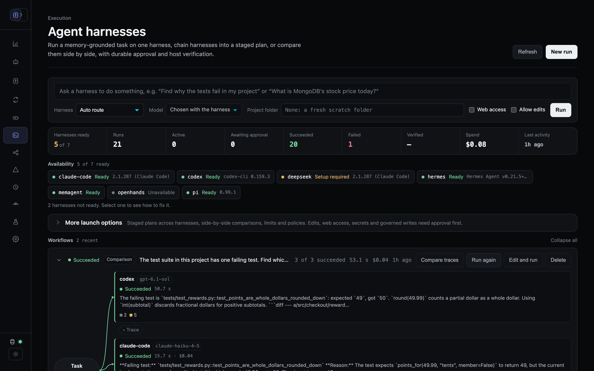

# Memory-First Meta-Harness

MemoRizz can run a workspace task through Codex, Claude Code, OpenHands, or a
native MemAgent while keeping memory, policy, approval, observability, and
continual-learning evidence in one control plane.

This is a *meta-harness*: it does not replace the vendor agent loop. It places a
stable host contract around several harnesses and normalizes their inputs,
events, results, and safety boundaries. It can also orchestrate them: a staged
plan passes one harness's work to the next (for example pi plans, Codex
implements, pi reviews), and a comparison runs the same task on several
harnesses at once. Both are available from the SDK, the JSON API and the local
UI.

For a runnable learning path, see
[`examples/metaharness`](https://github.com/RichmondAlake/memorizz/tree/main/examples/metaharness).
Its six notebooks progress from an offline adapter contract and durable
approvals to a real MemAgent runtime and a Codex + Claude Code multi-agent
review team. The final two notebooks audit the centralized evaluation protocol
and construct its direct-harness and coordinated-MemAgent topology from
scratch.

```text
application / MemAgent / CLI / UI / MCP
                  |
           MemoRizz MetaHarness
      memory -> route -> policy -> approval
                  |
      Codex | Claude Code | OpenHands | MemAgent
                  |
       normalized events + host verification
                  |
       traces + verified learning evidence
```



## When a MemAgent runs on a harness

Yes, a MemAgent running on a harness is a useful separation of concerns. Two
modes are available:

| Mode | Owns the main reasoning loop | Use it when |
|---|---|---|
| `runtime` | Codex, Claude Code, or OpenHands | The external coding agent should complete the whole workspace turn |
| `delegate` | Native MemAgent | The MemAgent should decide when to call a bounded specialist harness tool |

In both modes, MemoRizz owns tenant scope, memory retrieval, the durable run
record, exact approval envelopes, cancellation, host-side verification, and
learning evidence. A vendor checkpoint is diagnostic in this release; approval
resume is supported, but resuming a vendor's conversational session is not yet
part of the public contract.

## Install the harnesses

Install only the CLIs that you intend to operate:

- [Codex non-interactive mode](https://learn.chatgpt.com/docs/non-interactive-mode)
- [Claude Code programmatic mode](https://code.claude.com/docs/en/headless)
- [OpenHands headless mode](https://docs.openhands.dev/openhands/usage/cli/headless)
- [pi](https://pi.dev): `npm install -g @earendil-works/pi-coding-agent`
  (the older `@mariozechner/pi-coding-agent` package is deprecated)
- [Hermes Agent](https://hermes-agent.nousresearch.com) 0.21.4 or newer
  (Nous Research), which added `hermes chat --format stream-json`
- DeepSeek: install Claude Code and set `DEEPSEEK_API_KEY`. The `deepseek`
  harness runs Claude Code's agent loop against
  [DeepSeek's Anthropic-compatible API](https://api-docs.deepseek.com/quick_start/agent_integrations/claude_code).

The CLIs remain external executables; MemoRizz does not vendor or silently
install them. Confirm readiness with:

```bash
memorizz harness doctor
memorizz harness doctor codex
```

Claude Code builds that support `--restricted` and `--tools` run in restricted
mode: exactly the policy's built-in tools are loaded, file tools are confined to
the workspace, and user, project and local settings are ignored. A private
per-run `CLAUDE_CONFIG_DIR` keeps your own login, plugins and memory out of the
run. Older builds fall back to `--bare`, which loads only Bash, Edit and Read,
so Glob, Grep and web tools are unavailable there. In both modes OAuth and
keychain authentication are deliberately not used. Set `ANTHROPIC_API_KEY`, or configure one of Claude Code's supported
cloud-provider modes in the process environment. Codex may use its normal
`CODEX_HOME` authentication. OpenHands may use its normal CLI configuration,
but it will not be routed until the operator configures an external isolation
boundary.

### Missing credentials and login expiry

Capability probes and failed runs use the same secret-free error contract:
`error_code`, `error`, and `remediation`. Credential values are never included.

| Harness | A missing environment key means |
|---|---|
| Claude Code | Not ready: `--bare` disables OAuth/keychain fallback. Set `ANTHROPIC_API_KEY` or enable Bedrock, Vertex, or Foundry mode. |
| Codex | Not necessarily an error: an authenticated `CODEX_HOME` session may be used. A rejected/expired login is normalized when execution starts. |
| OpenHands | Not necessarily an error: provider or CLI configuration may supply credentials. MemoRizz separately requires an external isolation boundary. |
| DeepSeek | Not ready: set `DEEPSEEK_API_KEY`. Anthropic and cloud-provider credentials are never forwarded to DeepSeek. |
| Hermes | Not ready: set the configured provider's key (for example `ANTHROPIC_API_KEY` or `OPENROUTER_API_KEY`), or point `MEMORIZZ_HERMES_BASE_URL` at a local OpenAI-compatible server. Logins stored in your own `~/.hermes` are not used. |
| pi | Checked with `pi auth check` for the configured provider: its key (for example `DEEPSEEK_API_KEY`) or a stored `/login`. Without a configured provider, pi's own default is used. |

The result is identical across form factors:

- SDK: `probe()` returns capability details and `run()` returns a failed
  `HarnessResult` with `error_code="authentication_required"`;
- CLI: `harness doctor` and `harness run --json` print the same fields and a
  failed run exits non-zero;
- UI: the harness card displays setup guidance and the launch API returns HTTP
  409 with the durable failed run and structured error; and
- MCP: `memorizz_list_harnesses` reports adapters requiring authentication and
  `memorizz_start_harness_run` returns `ok=false`, the durable run, and the same
  structured error.

Start diagnosis with:

```bash
memorizz harness doctor claude-code --json
memorizz harness doctor codex --json
memorizz harness doctor openhands --json
memorizz harness doctor deepseek --json
memorizz harness doctor pi --json
memorizz harness doctor hermes --json
```

Runtime responses such as HTTP 401, invalid key, login required, or expired
credentials are normalized to `authentication_required`; raw vendor output is
kept out of the public error message and secrets remain redacted from events.

## SDK: run one bounded task

Trusted-host read-only runs do not require an approval unless they request
secrets, expanded tools, network access, or governed MCP writes. A verification
command supplied through a model-visible delegate or MCP tool also requires
approval because it executes as host code; a verification command configured
directly by the SDK, CLI, or authenticated UI is already a host decision.

```python
from pathlib import Path

from memorizz import (
    HarnessPermissions,
    HarnessTask,
    MetaHarness,
    VerificationSpec,
)

repo = Path("./my-project").resolve()

with MetaHarness.from_env(allowed_workspace_roots=[str(repo)]) as harness:
    result = harness.run(
        HarnessTask(
            task="Inspect the authentication flow and report likely defects.",
            workspace=str(repo),
            harness="auto",
            memory_id="engineering",
            user_id="alice",
            thread_id="auth-review",
            permissions=HarnessPermissions(
                workspace_mode="read_only",
                network="none",
                mcp_access="read_only",
            ),
            verification=VerificationSpec(command="python -m pytest -q"),
        )
    )

print(result.status.value, result.verified)
```

`HarnessResult.ok` is true only when execution succeeded and any required host
verification passed.

For machine-consumed results, pass `output_schema={...}` on `HarnessTask`, or
place the same key in `with_execution_harness(..., config=...)`. MemoRizz binds
the schema into the durable task/approval envelope and uses each supported
CLI's native structured-output gate (`--output-schema` for Codex and
`--json-schema` for Claude Code). Routing fails with
`output_schema_unsupported` instead of silently treating prompt-only JSON as a
contract.

Token budgets apply to the provider's reported usage for the complete harness
turn, including reasoning and tool iterations—not just the visible final
paragraph. Choose limits from observed traces, keep a hard wall-time and action
limit, and treat `budget_exceeded` as a failed run even if the vendor process
produced a useful draft. Numeric usage fields remain observable; credential and
session-token values remain redacted.

A cost limit (`max_cost_usd`) is checked against the cost the harness reports.
A MemAgent run reports its whole-run tokens, and its cost at list rates when
MemoRizz can price its model. A local model (Ollama, MLX, Hugging Face) has no
API charges, so a cost limit always holds; a cloud model MemoRizz has no price
for is refused when the run starts (`cost_budget_unpriced_model`) rather than
run without a working limit.

When a harness can't run a task as asked, the error says why in words, with
the code in brackets, and what to change: for example "Harness 'fake' can't
run this task: it can't return structured output (output_schema_unsupported).
Remove the output schema, or choose a harness that supports it." Setup advice
(install, sign in, pick a saved agent) appears only when setup is what's
missing.

When filesystem memories were created without vectors, MetaHarness retrieval
uses tenant-, memory-, and thread-scoped lexical fallback. A globally available
embedder therefore cannot silently hide an exact grounding record merely
because that record predates vector generation.

## Evaluate harness wrapping and coordination without confounding them

[`05_single_vs_multi_harness_evaluation.ipynb`](https://github.com/RichmondAlake/memorizz/blob/main/examples/metaharness/05_single_vs_multi_harness_evaluation.ipynb)
audits the earlier adaptive protocol and its committed artifact.
[`06_fair_harness_comparison_results.ipynb`](https://github.com/RichmondAlake/memorizz/blob/main/examples/metaharness/06_fair_harness_comparison_results.ipynb)
then constructs every adapter and MemAgent from scratch. Its corrected
`paired_factorial_v1` protocol crosses two memory providers with six execution
strategies:

1. direct `MetaHarness.run()` to Codex;
2. MemAgent to Codex;
3. direct `MetaHarness.run()` to Claude Code;
4. MemAgent to Claude Code;
5. a mandatory MemAgent panel that executes Codex and Claude Code; and
6. an adaptive MemAgent panel that executes Codex first and Claude only for
   host-identified structured-coverage gaps.

Here *direct* means direct use of MemoRizz's `MetaHarness`, without a MemAgent
wrapper. It is not a raw, ungoverned vendor CLI. Retaining the same scoped
memory context, permissions, schema, and host verification on both sides is
what makes direct-versus-wrapper a controlled estimate.

The panel delegates are runtime-backed MemAgents. The root uses deterministic
structured consolidation and has no LLM provider, so it cannot introduce a
hidden third model call. The full panel must record exactly one Codex and one
Claude run. The adaptive panel must prove Codex was its primary task and may
record one or two runs.

The notebook records independently judged quality, known-defect coverage,
unsupported claims, host verification, memory grounding, success, end-to-end
wall latency, usage tokens, normalized action lifecycles, output size, cost, and
cost per judge point. Each arm gets an isolated `memory_id` and identical base
requirements. Candidate identities, source IDs, and temporary paths are hidden
from the judge, and every candidate is scored in a separate stateless call to
avoid cross-candidate anchoring. The judge score remains secondary to
deterministic coverage, grounding, call-policy, and verification evidence.

The completed
[paid factorial evaluation](https://github.com/RichmondAlake/memorizz/blob/main/eval/results/2026-08-22-metaharness-factorial-paid.md)
demonstrates this boundary in practice. All arms reached 100% required-
criterion recall, but the scalar judge repeatedly used construct-irrelevant
style factors. MemoRizz retained those scores for audit, marked them invalid for
comparison, and based its efficiency conclusions on deterministic task gates.
Future failed judge attempts preserve their call and cost evidence before
validation.

Cost evidence is explicit about its basis. Claude Code supplies its reported
cost. Codex supplies token telemetry but not authoritative dollars, so the
evaluator calculates an API-equivalent estimate from a dated pricing snapshot.
Judge cost is evaluation overhead rather than an execution-arm cost. Unknown
model pricing remains `null` instead of being guessed.

Budget parity is per executed vendor harness. It does not mean every strategy
uses the same number of calls: a panel that escalates pays for a second harness,
while either baseline has exactly one. This is an orchestration comparison, not
equal-compute model benchmarking.

The comparison is fail-closed: every required worker and the panel root must be
grounded, every worker must report usage and cost, the schema and call policy
must hold, and host verification must pass before any candidate reaches the
judge. Host verification is an execution-health gate; it is not an answer
correctness oracle. A failed draft can remain in a diagnostic artifact but is
not ranked. The default notebook path makes no external calls; first inspect a
dry manifest:

```bash
python eval/metaharness/factorial_comparison.py \
  --profile factorial \
  --output /tmp/memorizz-factorial-dry-run.json
```

Then opt in to the paid path with:

```bash
MEMORIZZ_RUN_HARNESS_EVALUATION=1 \
python -m jupyter lab examples/metaharness
```

The paid cell runs the evaluator with two reverse-order-balanced repeats. It
creates both an isolated Filesystem provider and the configured Oracle provider
in the same paired run. Oracle preflight runs before any paid model call, its
version/vector/index capabilities are recorded in the artifact, provider-neutral
evidence fingerprints must match, and synthetic Oracle scopes are deleted at
cleanup. Treat Filesystem and Oracle results as separate provider strata rather
than pooling them silently.

One repeat is useful for adapter smoke testing only. More importantly, repeated
executions of one fixture are not independent task samples. The fixture is the
unit of inference, so a publishable comparison needs preregistered task
families, enough held-out tasks for task-level intervals, fixed model snapshots,
warm- and cold-cache conditions, another judge family, and blinded human
adjudication of disagreements. The evaluator therefore sets
`winner_allowed=false` for this fixture.

## Build a lean memory-first panel

More harnesses do not automatically produce a better answer. A panel is useful
when its workers have complementary responsibilities and the synthesis step is
grounded in the same authoritative evidence. MemoRizz therefore gives every
stage in a coordinated workflow one ranked, tenant-scoped evidence snapshot and
reuses that byte-identical snapshot across parallel delegates. The prompt keeps
the stable host contract and memory prefix first so provider prompt caching can
also reuse the common prefix. The root synthesizer reuses the same snapshot when
all delegate fingerprints match and it fits the root's evidence budget;
otherwise it performs a fresh scoped retrieval. Shared procedural evidence is
resolved under the root agent's ownership; a coincidentally reused workflow key
cannot expose one delegate's private skills or workflows to another agent.

This reuse lives above the `MemoryProvider` interface and applies to filesystem,
MongoDB, and Oracle. The MongoDB regression suite uses a real `mongomock`-backed
`MongoDBProvider` to verify exact `memory_id`/`user_id` scope, a bounded lexical
fallback when Atlas vector search is unavailable, degraded-retrieval
provenance, and no duplicate context build for the second workflow stage.

Configure the coordinator with a deterministic plan and bounded synthesis:

```python
from memorizz import MemAgentBuilder

coordinator = (
    MemAgentBuilder()
    .with_delegation(
        [codex_policy_reviewer, claude_verification_reviewer],
        enabled=True,
        mode="deterministic",
        plan=review_plan,
        evidence_context=True,
        max_dependency_context_chars=6_000,
        max_consolidation_result_chars=8_000,
        consolidation_strategy="model",
    )
    .with_learning_control_plane(
        True,
        config={
            "evidence_token_budget": 900,
            "evidence_max_items": 4,
            "compile_async": False,
        },
    )
    .build()
)

report = coordinator.run(
    task,
    memory_id="review-memory",
    user_id="alice",
    thread_id="change-481",
    context={"cache_data_version": git_commit_sha},
)
```

The four consolidation strategies make the quality/cost trade-off explicit:

| Strategy | Extra model call | Recommended use |
|---|---:|---|
| `model` | One | Merge genuinely complementary findings; the coordinator receives authoritative memory and may not invent claims |
| `structured` | None | Parse, allowlist, deduplicate, and union typed findings by criterion ID without asking another model to rewrite evidence |
| `deterministic` | None | Preserve all worker outputs as a structured report |
| `primary` | None | Return one named primary worker verbatim and keep the remaining reviews as evidence |

For bounded review or evaluation workloads, combine `structured` consolidation
with an adaptive escalation task. The first reviewer must return a JSON
`findings` list whose entries contain `criterion_id`, `title`, `finding`,
`severity`, `evidence`, `missing_tests`, and `source_ids`. MemoRizz checks the
IDs in host code. It invokes the fallback reviewer only when the primary output
is invalid, a primary task fails, or required coverage is missing:

```python
criteria = {
    "authorization": "role and ownership authorization",
    "expiry": "expiry precedence and timezone behavior",
    "verification": "reliable verifier semantics and missing tests",
}

coordinator = (
    MemAgentBuilder()
    .with_memory_provider(provider)
    .with_delegation(
        [codex_reviewer, claude_fallback],
        enabled=True,
        mode="deterministic",
        plan=[primary_task, fallback_task],
        return_report=True,
        consolidation_strategy="structured",
        required_finding_ids=list(criteria),
        adaptive_escalation={
            "enabled": True,
            "escalation_task_ids": ["fallback-review"],
            "criterion_descriptions": criteria,
        },
    )
    .as_ephemeral()
    .build(validate=False)
)
```

`report["execution"]` records whether escalation occurred, primary and
fallback latency, covered/missing IDs, and parse errors. Skipped fallback tasks
remain visible with `status="skipped"`; they do not count as workflow failures.
`report["consolidation"]["coverage"]` contains the deterministic union and
ignored out-of-contract IDs. Use model synthesis only when the task truly
requires prose reasoning across worker outputs.

`as_ephemeral()` suppresses automatic agent/tool configuration registration
for short-lived workers while retaining memory retrieval, run and trace
evidence, verification outcomes, and learning-control-plane records.

Use semantic caching for a *warm repeated workload*, not to improve a cold
one-repeat comparison. Delegation cache admission is fail-closed: the plan must
be deterministic, every delegate must be a verified read-only runtime harness,
network access must be disabled, and the caller must provide an explicit data
version such as a Git commit. The plan, delegate instructions, harness policy,
tool/model configuration, tenant, and version all contribute to the cache
identity. Configure the embedding provider explicitly; otherwise the default
global embedder may use a metered service.

Memory-first means selecting the right memory mechanism for the workload, not
turning every mechanism on for every call:

| Capability | Coordinated review policy |
|---|---|
| Ranked retrieval | Use on every cold run; scope before ranking and share one evidence snapshot |
| Provider prompt cache | Reuse the stable host and memory prefix; keep role-specific instructions later |
| Semantic cache | Use only for exact-policy, versioned, verified read-only repeats |
| Summaries | Retrieve an existing summary when it is the best evidence |
| Compaction | Run between long or repeated threads, never as overhead inside a one-shot review |
| Continual learning | Record verified delegate and root workflow evidence; promote only after repeated successful evidence and shadow gates |
| Forgetting | Apply asynchronously through a reviewed plan; never delete evidence merely to make one turn faster |

### Why the earlier panel cost more

The first valid one-repeat notebook diagnostic measured the Codex-only arm at
98/100 and about $0.00852 API-equivalent cost, the Claude-only arm at 98/100 and
$0.091038 reported cost, and the original panel at 87/100 and $0.141206 mixed
reported/estimated cost. These are local smoke-test measurements, not
leaderboard results.

The panel paid for two overlapping full reviews and then a third coordinator
call. Its Claude worker produced 7,867 output tokens versus 5,345 alone (about
47% more), because the adversarial role encouraged unrelated API and typing
tangents. The coordinator then synthesized delegate prose without independently
retrieving the original requirements, omitted one supported finding, and added
unsupported ones. Panel wall time also included the slowest parallel worker plus
the serial synthesis call.

The first optimization assigned bounded roles, shared one evidence pack, and
removed the coordinator-model call. It demonstrated useful adaptive behavior,
but it did not execute Claude in the panel rows and therefore could not estimate
two-harness coordination value.

The provider-comparison runner goes one step further: its
`structured_adaptive_v1` protocol uses the same structured output contract and
per-harness resource envelope for every arm, removes the coordinator model
call, and pays for Claude fallback only when Codex misses structural coverage.
It also records `phase_timings_ms` for context, MCP and output-schema setup,
adapter execution, verification, workspace finalization, and total runtime. Each context pack has
both an identity fingerprint and a provider-neutral `content_fingerprint`, so
the Filesystem/Oracle comparison fails closed if their panel workers did not
receive equivalent evidence content.

The corrected two-repeat run exercised that protocol end to end. Both panels
covered all six required findings without escalating to Claude or invoking a
synthesis model. Relative to the earlier panel implementation, mean execution
cost fell 87.1% on Filesystem and 85.8% on Oracle; gold coverage was maintained
or improved. Latency did not improve against the earlier stochastic sample, so
the report treats cost, quality, and latency as separate outcomes. See the
[optimized provider-comparison report](https://github.com/RichmondAlake/memorizz/blob/main/eval/results/2026-08-22-metaharness-provider-comparison-optimized.md)
for the complete protocol, results, limitations, and evidence boundary.
The companion
[`06_fair_harness_comparison_results.ipynb`](https://github.com/RichmondAlake/memorizz/blob/main/examples/metaharness/06_fair_harness_comparison_results.ipynb)
constructs both direct interfaces, both one-harness MemAgents, and the full and
adaptive model-less roots before building the corrected 12-arm matrix. It
reconstructs the historical four-arm table only to narrow its interpretation;
it does not invent corrected scores before a new paid artifact exists.

Notebook 06 now also includes the independent-task
[Claude Opus 5 small-suite report](https://github.com/RichmondAlake/memorizz/blob/main/eval/results/2026-08-23-metaharness-opus5-small-suite.md).
That regression holds Filesystem memory constant, pins GPT-5.6 Luna and Claude
Opus 5 to medium effort, uses one fresh workspace and scoped memory record per
task-arm, and scores 32 held-out task-native checks without an LLM judge. The
risk-routed panel uses one call per task; the always-on panel uses two, so their
compute difference remains explicit. The observed router result is descriptive:
one routed Opus execution passed a check that another Opus execution missed,
and one repeat cannot attribute that variance to routing.

## SDK: exact approval for edits

A direct-edit task pauses before the adapter starts. The proposal binds the
tool name, complete task arguments, workspace fingerprint, permissions,
budgets, verification command, scope, and expiry to a single-use ID.

```python
from memorizz import HarnessPermissions, HarnessTask, MetaHarness

harness = MetaHarness.from_env(allowed_workspace_roots=[str(repo)])
pending = harness.run(
    HarnessTask(
        task="Fix the failing parser tests without changing the public API.",
        workspace=str(repo),
        harness="codex",
        permissions=HarnessPermissions(
            workspace_mode="direct",
            network="none",
            mcp_access="read_only",
        ),
        verification={"command": "python -m pytest -q tests/test_parser.py"},
    )
)

proposal_id = pending.checkpoint["proposal_id"]
harness.approve(proposal_id, approver_id="release-owner@example.com")
result = harness.resume_approval(proposal_id)
```

The original checkpoint is executed; the model is never asked to reconstruct
approved arguments. A changed workspace invalidates the approval. Canceling a
pending or already-approved run prevents later execution. An existing dirty Git
worktree is rejected for write runs unless `allow_dirty_workspace=True` is part
of the approved envelope.

## Orchestrate harnesses: staged plans and comparisons

A **staged plan** runs stages in order, each on its own harness. A
**comparison** runs one read-only task on several harnesses at the same time.
Both return immediately with a durable workflow record. A background driver in
the host process starts each run and keeps the record current; if that process
restarts, the workflow is reported `interrupted` and later steps do not start.

```python
from memorizz.metaharness import MetaHarness

meta = MetaHarness.from_env(memory_provider=provider)
task = {
    "task": "Fix the rounding bug in invoice totals; keep the change minimal.",
    "workspace": "/srv/workspaces/billing",
    "memory_id": "billing-repo",  # handoffs are saved here
}

workflow = meta.start_plan(
    task,
    [
        {"name": "Plan", "harness": "pi", "instruction": "Write a short plan. Do not edit files."},
        {
            "name": "Implement",
            "harness": "codex",
            "workspace_mode": "direct",
            "verification": {"command": "python -m pytest -q"},
        },
        {"name": "Review", "harness": "claude-code", "instruction": "Review the change. Do not edit files."},
    ],
)
meta.get_orchestration(workflow["orchestration_id"])  # status, steps, run IDs

meta.start_compare({**task, "task": "Where can totals lose precision?"}, ["codex", "pi"])
```

Rules the SDK enforces:

- A stage without an `instruction` receives the plan's task. `model` and
  `agent_id` may be set per stage.
- At most one stage may edit files. It waits for host approval like any edit
  run; approve and resume it through the usual approval API, CLI or UI. An
  approval that expires cancels the stage.
- The plan stops at the first stage that does not succeed and records which
  stage failed and why. Later stages do not start.
- Comparisons are read-only, need at least two different named harnesses, and
  finish `failed` with `N of M harnesses succeeded` when any harness fails.
- `cancel_orchestration(id)` cancels the active runs and starts no further step.
- `delete_orchestration(id)` deletes a finished workflow with all its runs.
  `delete_run(id)`, `delete_runs(ids)` and `delete_conversation(id)` delete
  finished runs that are not workflow steps, with their events and the runs
  their MemAgent delegates made. A run or workflow still working is refused
  until it is canceled. A scratch folder MemoRizz made for a blank workspace
  is removed once no remaining run, workflow or delegate grant uses it
  (`remove_scratch=False` keeps it); files in your own folders and answers
  saved to memory stay.
- Every run in a workflow retrieves memory for the workflow's task and reuses
  one snapshot, so stages and compared harnesses see identical evidence.

The synchronous `run_plan()` keeps its behavior (it returns when a stage needs
approval) and now uses the same handoffs described below.

JSON API (blocked by `MEMORIZZ_UI_READ_ONLY=true` like every other mutation):

| Method | Path | Purpose |
|---|---|---|
| `POST` | `/api/harness-orchestrations` | `{"kind": "plan", "stages": [...]}` or `{"kind": "compare", "harnesses": [...]}` plus the single-run fields |
| `GET` | `/api/harness-orchestrations` | Recent plans and comparisons |
| `GET` | `/api/harness-orchestrations/{id}` | One workflow with its runs |
| `POST` | `/api/harness-orchestrations/{id}/cancel` | Cancel active runs; start no more |
| `DELETE` | `/api/harness-orchestrations/{id}` | Delete a finished workflow and its runs |
| `DELETE` | `/api/harness-runs/{id}` | Delete a finished run and its delegates' runs (`?keep_scratch=true` keeps its scratch folder) |
| `POST` | `/api/harness-runs/delete` | `{"run_ids": [...], "keep_scratch": false}`: delete several; lists what was kept and why |
| `DELETE` | `/api/harness-conversations/{id}` | Delete a conversation's finished turns |
| `GET` | `/api/harness-activity` | Change fingerprint used by the page's live refresh |

## Handoffs between harnesses and memory

Every harness's output stream is parsed into normalized events: messages, tool
calls and results, commands, file changes, usage and errors. They are stored
with the run and recorded as an observability trace.

When a stage finishes, MemoRizz reduces its events to a structured **handoff**:
the answer, changed files (relative to the workspace), recent commands,
verification result, error and run ID. The next stage receives every earlier
handoff, fitted to the stage-context budget. The latest stage keeps the most
room, and older answers are shortened from the middle, so the first plan is
never silently dropped. A harness can fetch any full transcript by run ID
through the MemoRizz MCP server.

When the task has a `memory_id`, each handoff, and the answer of a standalone
run, is also written to **conversation memory** (thread `harness-workflow-<id>` or `harness-run-<id>`,
or the task's `thread_id`). Runs a MemAgent starts are not saved again; the
agent records them in its own conversation. Retrieval, compaction and summaries then treat it like any other
turn. Later runs in the same memory scope receive it in their context pack, and
the Memory explorer lists it. Without a `memory_id`, answers stay in the run
ledger only.

## Continue a run as a conversation

Any run can continue: the next message is a new run with the same setup, and
earlier turns reach the harness as a "Conversation so far" section of its prompt
(each turn's request, answer, changed files and commands, fitted to the same
budget as stage handoffs). This works on every harness, whether or not its CLI
can resume a session. Turns share a conversation ID (`hxc-<first run id>`, also
used as the thread ID) and, when the task has one, the same `memory_id`.

```python
first = meta.run({"task": "Find why the tests fail", "workspace": "/repo", "harness": "codex"})
conversation = meta.conversation_id_for(meta.get_run(first.run_id))
follow_up = meta.continue_conversation(
    conversation,
    {"task": "Now fix it", "workspace": "/repo", "harness": "codex", "write": True},
)
turns = meta.conversation(conversation)  # oldest first
```

`continue_conversation` starts the turn in the background, like `start()`, and
edits or network access pause it for approval as usual.

## Harnesses as delegates

A MemAgent can coordinate harnesses: give it delegates that are agents in
**Run complete turns on a harness** mode (each with a default harness and,
optionally, a model), and turn delegation on. For each request the
coordinator's model splits the work, each delegate runs its part on its
harness in parallel, and the coordinator combines the results.

```python
codex = MemAgent(memory_provider=provider, llm_config=llm, name="Codex reviewer",
                 meta_harness=True, meta_harness_mode="runtime",
                 default_harness="codex", harness_config={"model": "gpt-6-luna"})
pi = MemAgent(memory_provider=provider, llm_config=llm, name="pi summariser",
              meta_harness=True, meta_harness_mode="runtime", default_harness="pi")
coordinator = MemAgent(memory_provider=provider, llm_config=llm, name="Coordinator",
                       delegates=[codex, pi],
                       delegation={"enabled": True, "mode": "auto", "max_workers": 2})
coordinator.run("Review mathlib.py for bugs, and summarise README.md.")
```

In the UI, add harness delegates from the agent's **Delegates** section, then
run the coordinator in the playground or as **memagent** on Agent Harnesses;
choosing it there lists the delegates and the harness each runs on. From the
CLI: `memorizz harness delegate create --harness codex --coordinator <id>
--attach`, then `memorizz harness run "..." --harness memagent --agent-id <id>`.

In a harness run, delegates work in that run's workspace and may use what it
was approved for (network, MemoRizz MCP, subagents, and edits when the run was
approved for **Allow direct workspace edits**) without a second approval. A
delegate whose own harness permissions are narrower (read-only, say) keeps
them. Delegates that edit take turns in the workspace under the run's lease;
the service checks that the parent run is still going and was approved for
that access in the same folder before it waives the approval. Each delegate
appears as a subagent in the trace with a link to its own harness run, which
the ledger tags **Delegate**.

- **Cancel** stops the coordinator between its model and tool calls and
  cancels every delegate run it started (including one still being prepared).
- **Cost**: the coordinator's row shows its own model calls priced at list
  rates (planning and combining included) plus its delegates' runs, marked
  "with delegates"; its details split the two.
- **Names**: the coordinator's final answer can say which delegate found what;
  results reach it labelled with each delegate's name and harness.

In the playground there is no harness run to approve, so the coordinator's
**Harness delegates** card grants the access instead (a folder, web access,
edits; web access and edits need an approver's name). The grant is recorded as
an approved `metaharness.delegate_access` approval that lasts eight hours
(`MetaHarness.grant_delegate_access()`, `delegate_access()`). Without one,
each conversation's delegates get a fresh scratch folder and no web access.

Harness delegates and model delegates differ. A harness delegate brings that
harness's own agent loop, tools and sandbox (Codex's shell, Claude Code's file
and web tools), which suits workspace and coding work. A plain MemAgent
delegate on another model shares MemoRizz's tools, memory and policies and runs
in process, which suits research, writing and analysis. A coordinator can mix
both.

## Configure a MemAgent

Runtime mode returns the external harness's final response from `agent.run()`:

```python
from memorizz import MemAgentBuilder

agent = (
    MemAgentBuilder()
    .with_name("Repository maintainer")
    .with_memory_ids("maintainer-memory")
    .with_execution_harness(
        "codex",
        config={
            "workspace": str(repo),
            "permissions": {
                "allowed_roots": [str(repo)],
                "mcp_access": "read_only",
            },
            "verification": {"command": "python -m pytest -q"},
        },
    )
    .build_and_save()
)

answer = agent.run(
    "Find the regression and fix it.",
    memory_id="maintainer-memory",
    user_id="alice",
    thread_id="issue-481",
)
```

Delegate mode registers `run_harness_task`, `get_harness_run`, and
`list_agent_harnesses` as governed MemAgent tools:

```python
agent = (
    MemAgentBuilder()
    .with_name("Engineering coordinator")
    .with_meta_harness(mode="delegate", default_harness="auto")
    .build()
)
```

The native recursion guard prevents a MemAgent from routing either a delegated
task or a full turn back into itself. A different saved MemAgent can still be
selected explicitly.

## CLI

```bash
# Create the secret-free adapter configuration.
memorizz harness init
memorizz harness config --json

# Read-only analysis.
memorizz harness run \
  "Find the cause of the failing tests" \
  --workspace "$PWD" \
  --harness auto \
  --mcp-access read_only \
  --verify "python -m pytest -q" \
  --timeout 900 \
  --max-steps 80

# Run one saved MemAgent through the same durable contract. Without
# --agent-id it runs the agent last used with a harness, else the newest.
memorizz harness run \
  "Review the release evidence" \
  --workspace "$PWD" \
  --harness memagent \
  --agent-id AGENT_ID

# Models each harness can run (the UI's model pickers).
memorizz harness models
memorizz harness models claude-code --json

# A write run returns pending_approval.
memorizz harness run "Implement the fix" --workspace "$PWD" --write --json
memorizz harness approvals --status pending
memorizz harness approve PROPOSAL_ID --approver operator@example.com

# Operations and evidence. Unknown IDs end with a message and exit code 1.
memorizz harness runs --json
memorizz harness show RUN_ID --events --json
memorizz harness events RUN_ID --after 10 --limit 100 --json
memorizz harness events RUN_ID --follow        # one JSON line per event until it ends
memorizz harness cancel RUN_ID                  # a memagent run stops its delegates' runs too
memorizz harness retry RUN_ID

# Keep talking to a harness: the setup carries over from the latest turn.
memorizz harness conversation RUN_ID
memorizz harness continue RUN_ID "Now add tests for that" --write
memorizz harness delete-conversation RUN_ID

# Delete finished runs (with their delegates' runs and any scratch folder
# nothing else uses; --keep-scratch keeps it). Workflow steps go with their
# workflow.
memorizz harness delete RUN_ID [RUN_ID ...]

# A question that needs no project runs in a fresh empty folder.
memorizz harness run "What is MongoDB's stock price today?" --scratch \
  --harness claude-code --network full

# Let Claude Code use its Task tool and Codex start sub-agents.
memorizz harness run "Survey the test suite" --harness codex --allow-subagents

# Narrow the tools, or require a structured answer.
memorizz harness run "List the public API" --allow-tool Read --allow-tool Grep \
  --deny-tool WebFetch --output-schema answer.schema.json

# A staged plan runs in this terminal until it finishes; approve its edit
# stage from another terminal or the UI. Ctrl+C cancels it.
memorizz harness plan "Fix the rounding bug" \
  --stage plan:pi --stage implement:codex:edit --stage review:claude-code \
  --instruction "plan=Write a short plan. Do not edit files." \
  --stage-verify "implement=python -m pytest -q" \
  --stage-model "review=claude-sonnet-5-5" \
  --memory-id billing-repo

# The same read-only task on several harnesses at once, each on its own model.
memorizz harness compare "Where can totals lose precision?" \
  --harness codex --harness pi --harness hermes \
  --harness-model pi=anthropic/claude-sonnet-5-5

memorizz harness workflows --json
memorizz harness show-workflow WORKFLOW_ID --json
memorizz harness cancel-workflow WORKFLOW_ID
memorizz harness rerun-workflow WORKFLOW_ID     # same settings, fresh scratch folder
memorizz harness delete-workflow WORKFLOW_ID

# Harness delegates: agents that run their share of a coordinator's work on a
# harness.
memorizz harness delegate options
memorizz harness delegate create --harness codex --model gpt-6-luna \
  --coordinator COORDINATOR_ID --attach
```

Create a persisted harness-backed agent without post-build mutation:

```bash
memorizz agents create \
  --name "Repository maintainer" \
  --no-llm \
  --harness-mode runtime \
  --default-harness codex \
  --harness-model gpt-6-luna \
  --harness-workspace "$PWD" \
  --json

# A coordinator with delegates (others' delegates that would loop are refused).
memorizz agents create --name "Code review crew" \
  --delegate CODEX_AGENT_ID --delegate CLAUDE_AGENT_ID \
  --delegation-max-workers 2 --delegation-consolidation model
memorizz agents update COORDINATOR_ID --add-delegate PI_AGENT_ID --no-root-fallback
memorizz agents delete AGENT_ID --yes   # coordinators stop using it as a delegate
```

`--default-harness`, `--harness-workspace` and `--harness-model` need
`--harness-mode`.

Agent creation validates that the selected adapter is registered, but it does
not require that vendor CLI or its credentials to exist on the machine creating
the record. This keeps persisted agent configuration portable across developer,
CI, and production hosts. `memorizz harness doctor` reports host readiness, and
every execution still fails closed with the structured remediation above when
the executable or authentication is unavailable.

## Local UI

Start the UI and open **Agent Harnesses**:

```bash
memorizz ui
```

The top of the page is a quick-launch bar: type a task, optionally pick a
harness and a project folder, tick **Web access** or **Allow edits**, and press
**Run** (or Cmd/Ctrl+Enter). With no project folder, MemoRizz creates an empty
scratch folder under `$MEMORIZZ_HOME/harness-workspaces/`, so questions like
"What is MongoDB's stock price today?" need no path. SDK callers get the same
with `MetaHarness.scratch_workspace()`. Web access and edits still need
approval, which the bar asks for inline; your approver name is remembered in
the browser. With Web access on, only harnesses that allow web access
(Claude Code, Codex, DeepSeek, Hermes) can be picked.

Below it, the page exposes adapter health, a launch form with three modes (single run,
staged plan with a stage editor and presets, comparison), the host approval
queue, a Workflows panel that shows each plan stage or compared harness with
its status, cost, answer and changed files, cancellation, a durable run ledger
tagged with each run's workflow stage, normalized event inspection, usage,
workspace changes, and verification evidence. The ledger's filter matches a
run's task, harness, MemAgent name, workspace or ID; a MemAgent run shows its
agent's name above its model. While work is active the page
updates in place every few seconds, with no reload: running items show a
spinner and their elapsed time counts up. Agent create/edit pages persist
runtime or delegate mode, the default harness, and a workspace allowlist.

- **Trajectory.** Selecting a run shows the steps it took (memory context,
  session, messages, commands with exit codes, tool calls with their results,
  file changes, usage and the outcome), updating live while it runs. **Full
  view** and **Evidence** open it larger, next to the raw run record. The
  **Steps** column counts messages, commands, tool calls and file edits per run.
- **Execution graph.** Each plan or comparison is drawn as nodes: comparisons
  fan out from the task to one lane per harness, plans run left to right, and
  the edge into a running node is animated.
- **Continue.** Opens the run as a conversation on `/harnesses/chat` with its
  harness, model, folder, permissions, agent, memory ID and limits carried over
  and editable (see above).
- **Models.** Harnesses run their own default model unless you pick one; the
  quick bar and launch form suggest the models each harness lists. Codex's
  default is the first model in its local catalog (`codex debug models`), passed
  explicitly so the ledger names it.
- **memagent.** It runs a saved MemAgent. When a run, plan or comparison
  includes it without one, MemoRizz uses the agent you last ran a harness with,
  else your newest agent, and says which; with no saved agent it refuses before
  anything starts.
- **Cost.** Claude Code reports its cost. For Codex, MemoRizz estimates it at
  OpenAI list rates from the reported tokens, shown as ≈; on a ChatGPT plan
  Codex is billed by the plan, not per token.
- **Run again.** A finished plan or comparison can be repeated with the same
  settings, or loaded into the launch form with **Edit and run** to change
  something first (for example Network). A blank-workspace run gets a fresh
  scratch folder again.
- **Live trace.** **Live trace** under a workflow node shows that harness's
  steps as they happen: reasoning, model calls, tool calls with results, and
  subagents, with a subagent's own steps nested under it. What appears depends
  on what the harness reports: Codex sends no reasoning text and no web-search
  query; Claude Code marks where it reasoned but may withhold the text; a
  MemAgent reports every model call, tool call and delegate task.
- **Models on the graph.** Each node, ledger row and run's details name the
  model the harness reported, while it runs.
- **Subagents.** Tick **Subagents** to let harnesses start their own: Claude
  Code gets its `Task` tool (with the run's other tools), Codex may start
  sub-agents, and a memagent delegates to the agents chosen in its
  **Delegates** section on the Agents page. It works in single runs,
  comparisons and plans. Each subagent appears in the node's trace, by name,
  with its own steps nested under it. Codex sub-agents are read from their
  session files, which is also where their search queries show. Ask for work
  that splits, e.g. "use a separate subagent for each company, in parallel".
- **Compare traces.** On a plan or comparison, **Compare traces** opens its
  runs side by side; in the ledger, tick two to four runs and press **Compare
  selected**. You get a facts table (time, cost, tokens, actions, verification,
  with the fastest, cheapest and leanest successful run marked), a timeline
  with one lane per run starting at zero, and each run's answer and steps in
  columns. Which answer is right is left to you. Two MemAgents compare the
  same way (say one agent with a tool cache and one without): each MemAgent
  lane is named by its agent, a **Tool cache** row counts the tool calls each
  run answered from its cache, and those calls show as outlined bars on the
  timeline and as "from cache" in the steps. See
  [Tool call cache](context-efficiency.md#tool-call-cache).
- **Model per harness.** In **Compare**, each ticked harness gets its own model
  picker. Every model field is a dropdown of up to ten of the newest models
  from each provider that harness runs (from the providers' own model lists,
  plus local Ollama models), the harness default first and **Other model…**
  last for any name. memagent runs its agent's model by default; picking one
  runs the saved agent on it for that run only (`provider/model` switches
  provider). A warning appears when a harness can't run a model's provider.
- **OpenHands and Hermes.** OpenHands runs only behind an isolation wrapper
  (`external_isolation: true` in `harnesses.json`), only with Network Full, and
  the form picks the Docker wrapper backend for it. Hermes keeps each run's
  home under `~/.hermes/profiles`.
- **Only what applies.** The launch form hides options the chosen harness(es)
  can't use: the saved agent unless memagent is in the run, tool lists unless a
  harness takes them, cost and token limits unless every chosen harness
  reports them, the isolation backend unless a harness needs a wrapper, and
  the uncommitted-worktree option unless the run edits.
- **Folding.** Workflow cards fold to one line with a status dot per harness;
  the newest and any running workflow start open, and your choice is kept.
- **Web, tools and sandboxes.** **Network → Full** gives Claude Code WebSearch
  and WebFetch, Codex live web search, and a memagent its agent's internet
  provider (or MemoRizz's Tavily/Firecrawl key); it needs approval. **Allowed
  tools** / **Denied tools** apply to Claude Code-based harnesses; a memagent
  uses its saved agent's tools and connected apps. Codex and Claude Code sandbox themselves; a MemAgent runs
  code in its agent's sandbox provider. The form greys out harnesses that can't
  honour a choice.

Set `MEMORIZZ_UI_AUTH_TOKEN` before exposing the UI beyond a trusted local
machine. `MEMORIZZ_UI_READ_ONLY=true` blocks all launch, decision, resume, and
cancel endpoints, not only their visible controls.

## First-party MCP server

The MemoRizz MCP server exposes model-usable discovery and execution tools:

- `memorizz_list_harnesses`
- `memorizz_start_harness_run`
- `memorizz_get_harness_run`
- `memorizz_list_harness_runs`
- `memorizz_get_harness_events`
- `memorizz_cancel_harness_run`
- `memorizz_retry_harness_run`
- `memorizz_start_harness_plan` and `memorizz_start_harness_comparison`
- `memorizz_list_harness_workflows`, `memorizz_get_harness_workflow`,
  `memorizz_cancel_harness_workflow` and `memorizz_rerun_harness_workflow`
- `memorizz_get_harness_conversation` and
  `memorizz_continue_harness_conversation`
- `memorizz_delete_harness_runs` and `memorizz_delete_harness_workflow`
  (marked destructive; only the caller's runs)

Runs, plans and comparisons take `allow_subagents`; comparisons take
`harness_models` (`{"claude-code": "claude-sonnet-5-5"}`) for a model per
harness.

A start without a `workspace` runs in a fresh empty folder. Every run is
model-initiated, so edit stages and model-supplied verification commands wait
for host approval.

Approval and rejection remain host-side decisions. The model-visible start
schema has no `approved` or `confirm` Boolean. Configure workspace roots and
enable execution explicitly for remote HTTP:

```bash
memorizz mcp serve \
  --transport streamable-http \
  --allow-writes \
  --allow-agent-execution \
  --allow-harness-execution \
  --harness-workspace-root /srv/workspaces/project-a
```

Every remote run and workflow is bound to the authenticated MCP principal as
`user_id`. Run and workflow lookup, event lookup, listing, retry and
cancellation apply the same tenant filter.

## Reaching the agent's MCP servers

A harness run for an agent reaches that agent's own MCP servers (Notion,
Gmail, Calendar and others) through the MemoRizz MCP server it already uses,
never directly. The OAuth tokens stay in MemoRizz's encrypted store, every call
is audited under the agent, and changes follow the agent's approval policy.

| Tool | What it does |
|---|---|
| `memorizz_list_connected_tools` | The agent's servers, whether each is signed in, and which tools change data |
| `memorizz_read_connected_tool` | Calls a tool that only reads. Marked read-only, so hosts that never prompt (such as Codex runs) allow it |
| `memorizz_call_connected_tool` | Calls any tool. Needs write access (`mcp_access="governed_write"`); a change returns `approval_required` |
| `memorizz_resume_connected_tool_call` | Runs a change after a person approves it on **MCP connections** |

`agent_id` can be left out: a harness run's server exposes only its agent.
Harness runs also receive `MEMORIZZ_HOME`, `MEMORIZZ_MEMORY_ROOT` and
`MEMORIZZ_BACKEND` when set, so the server finds the same memory store,
credentials and cached tool lists. Connection strings are never written to the
run's MCP configuration.

## Adapter policy matrix

| Adapter | Local file boundary | Network modes | Cost/token budgets | Important constraint |
|---|---|---|---|---|
| Codex | Codex `read-only` or `workspace-write` sandbox | `none`, `full` (live web search; network for commands in editing runs) | token telemetry; cost estimated at OpenAI list rates | User config is ignored; host overrides disable project hooks, extra writable roots and non-MemoRizz MCP servers, keep web search and egress off unless the network is `full`, and keep sub-agents off unless subagents are allowed |
| Claude Code | Hard-denied Bash; `--restricted` loads only the policy's tools and confines file tools to the workspace | `none`, `full` | cost and token telemetry plus a native turn cap | Requires environment/cloud authentication; builds without `--restricted` fall back to `--bare` (no Glob, Grep or web tools) |
| OpenHands | Operator-provided isolated wrapper | wrapper-defined | wall time and normalized action count | Headless mode is always-approve and never runs locally by default |
| Native MemAgent | Existing MemAgent tool/provider policies | `none` (web tools hidden for the run), `full` (the agent's internet provider, or MemoRizz's default for the run) | configured MemAgent step limit; whole-run tokens, cost at list rates when the model can be priced (local models have no API charges) | Standalone surfaces require explicit `harness=native` plus a saved `agent_id`; self-routing is rejected |
| DeepSeek | Same as Claude Code (it is Claude Code's runtime) | `none`, `full` | token telemetry; cost estimated from DeepSeek's price table (peak and off-peak), not Claude Code's Anthropic prices | Only `DEEPSEEK_API_KEY` reaches the process, mapped for DeepSeek's Anthropic-compatible endpoint. Anthropic does not support routing Claude Code to non-Claude models, so treat it as DeepSeek-supported |
| Hermes | `file` toolset only; `HERMES_WRITE_SAFE_ROOT` is the workspace for edit runs and an empty folder otherwise, so read-only runs cannot write | `none`, `full` (adds the `web` toolset) | token telemetry; no cost report | Each run gets a generated `HERMES_HOME`: update checks, borrowed Claude Code/Codex/GitHub logins, extra title-generation calls and the security-scanner download are off; dangerous commands are denied; `terminal`, `code_execution`, `browser`, `delegation`, `memory` and `skills` are never enabled; `hermes -z` (which auto-approves commands) is never used. Reads are not confined to the workspace |
| pi | File tools only (`read`, `grep`, `find`, `ls`; `edit`, `write` for edit runs); `bash` is never enabled | `none` | per-message cost and token telemetry from pi | No sandbox or MCP client: read-only MCP falls back to the context pack; edit runs require an isolation wrapper (`MEMORIZZ_PI_EXTERNAL_ISOLATION=true`); project extensions, skills and context files are disabled |

The in-process native adapter is a composition convenience, not a process
isolation boundary. Cancellation is guaranteed before the turn starts; once a
model-provider call is in flight it is cooperative, and the provider owns its
timeout. Use Codex, Claude Code, or an isolated OpenHands worker when the host
must be able to terminate a process independently.

pi's edit and write tools are not confined to the workspace, so MemoRizz routes
pi edit runs only when the configured `pi` command is a wrapper that enters an
isolation boundary and the operator attests to it. Read-only pi runs have no
command or web tools; pi only reaches its model provider.

`restricted` network mode is reserved for custom or externally isolated
adapters that can enforce an allowlist. Bundled Codex and Claude adapters do not
claim this mode. Model-provider API traffic is part of the harness control
channel; the network policy governs agent tools and workspace processes.

OpenHands must be configured with a wrapper executable that actually enters a
Docker, remote, or sandbox boundary. A task's `execution_backend="docker"`
label alone is rejected:

```json
{
  "version": 1,
  "adapters": {
    "openhands": {
      "command": "/usr/local/bin/openhands-isolated",
      "enabled": true,
      "external_isolation": true
    }
  }
}
```

The wrapper must preserve OpenHands CLI arguments and enforce filesystem,
process, CPU, memory, and egress policy itself.

## Configuration

`memorizz harness init` writes `$MEMORIZZ_HOME/harnesses.json` with mode `0600`.
It contains no credentials:

```json
{
  "version": 1,
  "allowlist": ["memagent", "codex", "claude-code", "openhands", "deepseek", "pi", "hermes"],
  "preference": ["memagent", "codex", "claude-code", "openhands", "deepseek", "pi", "hermes"],
  "allowed_workspace_roots": ["/srv/workspaces"],
  "context_max_chars": 24000,
  "adapters": {
    "codex": {"command": "codex", "enabled": true, "model": null},
    "claude-code": {"command": "claude", "enabled": true, "model": null},
    "openhands": {
      "command": "openhands",
      "enabled": true,
      "model": null,
      "external_isolation": false
    },
    "deepseek": {"command": "claude", "enabled": true, "model": null},
    "pi": {
      "command": "pi",
      "enabled": true,
      "model": null,
      "provider": null,
      "external_isolation": false
    },
    "hermes": {
      "command": "hermes",
      "enabled": true,
      "model": null,
      "provider": null,
      "base_url": null
    }
  }
}
```

When no root is configured, environment-backed services restrict workspaces to
their current working directory. An explicit SDK-constructed `MetaHarness`
may supply its own roots.

| Variable | Purpose |
|---|---|
| `MEMORIZZ_CODEX_COMMAND` / `MEMORIZZ_CODEX_MODEL` | Codex executable and default model |
| `MEMORIZZ_CLAUDE_CODE_COMMAND` / `MEMORIZZ_CLAUDE_CODE_MODEL` | Claude executable and default model |
| `MEMORIZZ_OPENHANDS_COMMAND` / `MEMORIZZ_OPENHANDS_MODEL` | OpenHands wrapper and default model |
| `MEMORIZZ_OPENHANDS_EXTERNAL_ISOLATION` | Operator attestation that the wrapper enforces isolation |
| `MEMORIZZ_DEEPSEEK_COMMAND` / `MEMORIZZ_DEEPSEEK_MODEL` | Claude Code executable for the DeepSeek harness and its model (`deepseek-flash` by default, or `deepseek-v4-pro`) |
| `MEMORIZZ_PI_COMMAND` / `MEMORIZZ_PI_MODEL` / `MEMORIZZ_PI_PROVIDER` | pi executable, model and provider (for example `deepseek` and `deepseek-flash`); a `provider/model` value also works |
| `MEMORIZZ_HERMES_COMMAND` / `MEMORIZZ_HERMES_MODEL` / `MEMORIZZ_HERMES_PROVIDER` | Hermes Agent executable, model and provider (for example `anthropic` and `claude-sonnet-5`, or `openrouter`) |
| `MEMORIZZ_HERMES_BASE_URL` | A local OpenAI-compatible server for Hermes (provider `custom`), such as Ollama at `http://127.0.0.1:11434/v1` |
| `MEMORIZZ_PI_EXTERNAL_ISOLATION` | Operator attestation that the pi command enters an isolation boundary; required for pi edit runs |
| `MEMORIZZ_HARNESS_ALLOWLIST` | Comma-separated adapter allowlist |
| `MEMORIZZ_HARNESS_CONTEXT_MAX_CHARS` | Upper bound for rendered memory context |

Pin Claude Code reasoning effort per task through the SDK harness metadata:

```python
agent = (
    MemAgentBuilder()
    .with_execution_harness(
        "claude-code",
        config={
            "model": "claude-opus-5",
            "metadata": {"claude_effort": "medium"},
        },
    )
    .build(validate=False)
)
```

Accepted values are `low`, `medium`, `high`, `xhigh`, and `max`. For pi, set
`metadata={"pi_thinking": "high"}` (`off`, `minimal`, `low`, `medium`, `high`,
`xhigh` or `max`).
Invalid values fail before the CLI launches. Record effort alongside the model
ID in evaluation manifests because Claude Opus 5 defaults to high effort in
Claude Code, which materially changes cost, latency, and output-token use.

For MCP-specific enablement and roots, see the [MCP server guide](mcp-server.md).

## Memory and continual learning

Before execution, MemoRizz retrieves a bounded, tenant-scoped context pack from
summaries, conversation, entity, workflow, Skillbox, and knowledge-base memory.
Records must match `memory_id`, exact `user_id`, and compatible `thread_id`
before they enter the prompt. Credentials, embeddings, raw checkpoints, and
oversized records are removed or bounded.

After execution, normalized events and the outcome enter observability. A run
also produces immutable run, workflow, and outcome events in the learning
control plane. Only host-verified outcomes are authoritative for continual
learning and workflow-to-skill promotion. An unverified success remains useful
operational evidence but cannot establish that a procedure is correct.

## Durability and deployment boundary

The built-in run store is transactional SQLite with WAL mode, cross-process
event sequencing, persistent cancellation requests, heartbeats, and one writer
lease per workspace. It is a reliable single-node/self-hosted boundary, not a
distributed queue. Use one worker owner for execution, keep the database on
durable local storage, and call `recover_interrupted_runs()` only when that
worker is known to be stopped.

MongoDB and Oracle remain the memory and learning-evidence providers; harness
run coordination itself stays deliberately small and local in this release.
