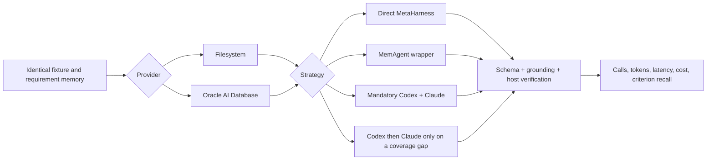

# MemoRizz paid MetaHarness factorial evaluation

**Filesystem and Oracle AI Database · 22 August 2026**

## Outcome

The paid systems run completed all 24 arm observations successfully. Every
execution was grounded, host-verified, structurally complete, and recovered all
six required review criteria. The main result on this fixture is therefore an
efficiency result, not a general accuracy ranking:

- The adaptive Filesystem panel used one Codex call, retained 100% required-
  criterion recall, and was **44.3% faster, 95.2% cheaper, and 20.4% lower in
  reported tokens** than the mandatory Filesystem Codex+Claude panel.
- The adaptive Oracle panel retained the same recall and was **27.1% faster,
  95.6% cheaper, and 34.8% lower in reported tokens** than the mandatory Oracle
  panel.
- The full panel supplied no additional required-criterion recall on this
  ceiling-level fixture. That does not establish that redundancy has no value
  on harder or more diverse tasks.
- Known paid spend was **at least $1.87010225**: $1.65243825 for 28 harness
  calls and $0.217664 for 49 judge calls with retained usage. Four additional
  fail-closed judge attempts have unavailable usage, so the known total is a
  lower bound—not an exact invoice total. Separately, two Claude subprocesses
  were briefly launched and terminated when an authentication-negative test
  incorrectly inherited the repository dotenv file; their usage is also
  unavailable and is outside the protocol artifact.

This is a controlled engineering experiment on one synthetic code-review
fixture with two repeated executions. It is not paper-comparable, statistically
powered, or suitable for a leaderboard claim. No general winner is declared.

The sanitized [machine-readable artifact](2026-08-22-metaharness-factorial-paid.json)
contains the compact run records, fixture and protocol hashes, provider
preflights, call telemetry, panel consolidation evidence, judge results,
corrections, cleanup reports, and claim boundaries. Raw response text and its
duplicated per-record coverage projection are intentionally omitted from the
committed artifact; the retained summary, judge, run, and cost fields reproduce
the published tables without bloating the repository.

## What is being compared?

An **agent harness** is the runtime around a model: workspace access, tools,
permissions, budgets, context, verification, telemetry, and result durability.
MemoRizz is a harness when a MemAgent owns that loop. It is a **MetaHarness**
when the same governed MemAgent interface runs another complete harness such as
Codex or Claude Code.

The fixture asks each system to review an intentionally flawed export policy.
The six allowlisted criteria cover expiry precedence, auditor authorization,
case-sensitive owner identifiers, UTC-aware time handling, verifier integrity,
and the missing test matrix.

Each provider ran six strategies:

1. Direct MetaHarness → Codex.
2. MemAgent → Codex.
3. Direct MetaHarness → Claude Code.
4. MemAgent → Claude Code.
5. MemAgent mandatory Codex+Claude panel.
6. MemAgent adaptive Codex-first panel.

“Direct” still uses the MetaHarness security and verification envelope. It
means no MemAgent wrapper; it does not mean an ungoverned raw CLI invocation.

## Fairness controls

| Threat | Control |
|---|---|
| Different task or evidence | Exact fixture-byte, requirements, schema, and gold hashes |
| Provider context drift | All 24 scopes returned one provider-neutral content fingerprint and 107-token context estimate |
| Stale memory | Cold unique memory/user/thread scope for every arm and repeat |
| Order effects | Seeded order followed by its exact reverse; mean position 6.5 for every arm |
| Different worker budgets | Same read-only workspace, no network/MCP, timeout, step, output, and verification policy per harness call |
| Hidden partial failure | Wrong calls, failed grounding, failed verification, parse errors, missing IDs, or incomplete cost invalidate execution |
| Panel ambiguity | Mandatory and adaptive panels are separate arms; the mandatory panel always made both calls |
| Model synthesis confound | Panel consolidation was deterministic and made no coordinator-model call |
| Identity bias | Candidate labels were randomized and each candidate received an independent judge call |

Repeats are repeated measurements of one fixture, not two independent research
samples. The live models are also stochastic; paired deltas remain descriptive.

## Environment

- Codex CLI 0.149.0, `gpt-5.6-luna`.
- Claude Code 2.1.202, mutable `sonnet` alias.
- GPT-4.1 diagnostic judge.
- Python 3.12.13.
- Oracle AI Database 26ai Free, `version_full=23.26.0.0.0`, PDB `READ WRITE`.
- 384-dimensional Oracle vector columns, lazy index policy, exact-search
  fallback, compatible embeddings, and no Oracle preflight diagnostics.
- Filesystem and Oracle provider preflights passed before paid execution.

OpenHands was not part of this protocol. Its absence is not an environment
failure for a Codex-and-Claude comparison.

## Results

Required-criterion recall is the primary task metric. The LLM scalar is shown
only as a diagnostic; its construct-validity limitation is explained below.

| Arm | Provider | Criterion recall | Diagnostic LLM score | Latency | Cost/task | Input | Output | Calls |
|---|---|---:|---:|---:|---:|---:|---:|---:|
| Direct Codex | Filesystem | 100% | 96.0 | 52.226 s | $0.00776290 | 44,568 | 2,497 | 1 |
| MemAgent → Codex | Filesystem | 100% | 99.5 | 49.918 s | $0.00675098 | 58,446 | 2,278 | 1 |
| Direct Claude | Filesystem | 100% | 100.0 | 72.796 s | $0.11650903 | 5,486 | 7,214 | 1 |
| MemAgent → Claude | Filesystem | 100% | 100.0 | 87.226 s | $0.13662083 | 5,485 | 8,554 | 1 |
| Mandatory panel | Filesystem | 100% | 99.5 | 76.962 s | $0.12900738 | 57,036 | 9,901 | 2 |
| Adaptive panel | Filesystem | 100% | 96.5 | 42.882 s | $0.00623688 | 51,258 | 1,992 | 1 |
| Direct Codex | Oracle | 100% | 98.5 | 45.396 s | $0.00506634 | 44,560 | 2,056 | 1 |
| MemAgent → Codex | Oracle | 100% | 93.5 | 56.030 s | $0.00720274 | 53,782 | 2,684 | 1 |
| Direct Claude | Oracle | 100% | 100.0 | 76.234 s | $0.12382795 | 5,479 | 7,702 | 1 |
| MemAgent → Claude | Oracle | 100% | 100.0 | 67.434 s | $0.10901090 | 5,494 | 6,712 | 1 |
| Mandatory panel | Oracle | 100% | 100.0 | 92.763 s | $0.17063161 | 63,612 | 12,046 | 2 |
| Adaptive panel | Oracle | 100% | 97.5 | 67.649 s | $0.00759160 | 46,223 | 3,134 | 1 |

Codex and Claude report token usage with different cache and accounting
semantics, so raw token counts are useful within matched harness comparisons
but should not be treated as vendor-neutral compute units.

### Adaptive versus mandatory panel

Left-minus-right deltas compare adaptive with mandatory execution.

| Provider | Recall delta | Latency delta | Cost delta | Token delta | Call delta |
|---|---:|---:|---:|---:|---:|
| Filesystem | 0 points | **−34.081 s** | **−$0.12277050** | **−13,687** | −1 |
| Oracle | 0 points | **−25.114 s** | **−$0.16304001** | **−26,301** | −1 |

The explanation is structural. Both adaptive runs found all six criteria in the
Codex result, so the deterministic coverage gate correctly skipped Claude. The
mandatory panel always paid for both independent reviews. Claude's much larger
observed output and higher reported cost dominate full-panel spend; Oracle is
not the cause of that cost increase.

### MemAgent wrapper deltas

| Harness/provider | Recall delta | Latency | Cost | Tokens |
|---|---:|---:|---:|---:|
| Codex/Filesystem | 0 | −2.309 s | −$0.00101192 | +13,659 |
| Claude/Filesystem | 0 | +14.429 s | +$0.02011180 | +1,340 |
| Codex/Oracle | 0 | +10.635 s | +$0.00213640 | +9,849 |
| Claude/Oracle | 0 | −8.801 s | −$0.01481705 | −976 |

The signs reverse across provider/model pairs. With only two stochastic calls
per arm, these end-to-end differences cannot be attributed cleanly to wrapper
code. A replay harness should measure pure MemoRizz control-plane overhead;
live trials should measure the complete user-observed system.

### Provider sensitivity

Every provider pair used identical retrieved content. Oracle-minus-Filesystem
latency ranged from −19.792 to +24.767 seconds and cost ranged from −$0.027610
to +$0.041624 depending on strategy. Those inconsistent signs, combined with
the tiny sample, are generation/runtime variance—not evidence that a memory
database changes model pricing. What this run establishes is provider parity
for scoped seeding, retrieval, provenance, execution, observation, and cleanup.

## Judge audit and why scalar “accuracy” is diagnostic only

The judge layer exposed two reporting defects that MemoRizz now handles
fail-closed:

1. Four initial replies used fractional rubric points (`0.35/0.30/...`) rather
   than point values (`35/30/...`). The retained raw components allowed a
   deterministic ×100 scale correction, recorded per result.
2. A complete all-candidate rejudge still deducted points for verbosity,
   redundancy, repetition, formatting, or restating instructions, despite the
   identity-blind rubric forbidding those factors. A stricter follow-up pass
   failed its rationale validator twice, and no partial output from that pass
   was accepted.

The artifact therefore preserves the complete diagnostic scalar pass for
audit, but sets `llm_judge_scalar_valid_for_comparison=false`. Comparative
quality claims use deterministic required-criterion recall and the supporting
gates instead. All 24 outputs had:

- 6/6 required criterion IDs after strict structured parsing;
- complete grounding in the expected scoped source;
- successful host verification;
- all six gold IDs recognized by the diagnostic judge;
- zero judge-listed unsupported claims.

Criterion recall does not prove that every sentence is semantically perfect.
A research-grade suite needs independent task families, task-native scorers,
and human or cross-family adjudication for judge disagreement.

## Environment and reporting fixes made from the paid run

- Layered dotenv loading now reads the repository environment without shell
  evaluation; values are never printed. A literal shell `source .env` had
  failed on an unquoted `&` in an unrelated value.
- Authentication-negative tests can disable dotenv loading explicitly, so a
  local `.env` cannot accidentally turn a unit test into a paid run.
- Numeric token summaries, paired token deltas, and context token estimates
  survive credential redaction.
- Known repository, home, and temporary run prefixes are replaced with stable
  publishable labels. The committed artifact contains no detected credential
  patterns or local absolute paths.
- Judge scaling is explicit, fractional legacy scaling is tagged, prohibited
  scoring rationales fail closed, and every retry is costed before validation.
- Judge failures retain their paid-call accounting in structured error
  artifacts. Four attempts made before that fix have unknown usage and remain
  explicitly excluded from the known-spend lower bound.
- Oracle readiness, product/version, PDB state, dimensions, index policy, and
  fallback behavior are recorded once as structured preflight evidence.

During development, the dotenv-isolation regression launched two Claude test
subprocesses before it was detected. Both were terminated, no completed result
was accepted, and no durable usage record was available. The explicit
`MEMORIZZ_EVAL_DISABLE_DOTENV=1` test boundary now prevents recurrence. This
incident is disclosed separately because folding unmeasured non-protocol calls
into a precise benchmark cost would be misleading.

## What to improve next

1. Add several preregistered, independent fixtures at different difficulty
   levels. This fixture saturated criterion recall and cannot reveal the value
   of redundancy on hard cases.
2. Make task-native deterministic scoring primary across the evaluation suite;
   use LLM judges for semantic disagreement analysis, not as an unqualified
   universal accuracy number.
3. Add a deterministic replay adapter to isolate wrapper/control-plane latency
   from vendor generation variance.
4. Pin dated model snapshots where each vendor supports them; `sonnet` is a
   mutable alias.
5. Persist usage immediately after every judge call, including validation
   failures. The evaluator now does this for future runs.
6. Run a stratified task set before drawing provider, harness, or coordination
   conclusions and report task-level confidence intervals.

The defensible conclusion is narrow but useful: MemoRizz successfully governed
Codex and Claude Code through one memory-first contract on both Filesystem and
Oracle, and coverage-gated early stopping removed a redundant expensive call on
this fixture without losing any required criterion, grounding, or verification
gate.
