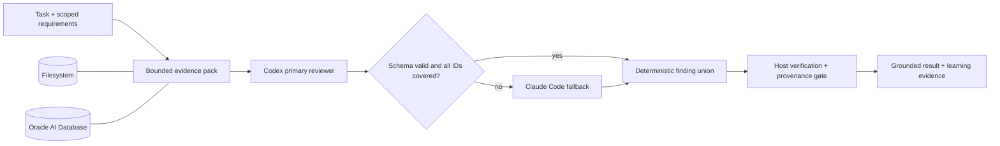

# MemoRizz MetaHarness optimization evaluation

**Filesystem and Oracle AI Database — adaptive paired run, 22 August 2026**

> **Methodological clarification added after the run:** both rows named
> “MemoRizz Panel” executed Codex once and did not trigger Claude. The artifact
> is valid evidence for coverage-gated early stopping and matched provider
> behavior on this fixture. It does **not** measure mandatory Codex-plus-Claude
> coordination and must not be used to claim that a two-harness panel beat a
> one-harness baseline. The later `paired_factorial_v1` protocol adds direct,
> MemAgent-wrapper, mandatory dual-harness, and adaptive arms to answer those
> questions separately.

The key optimization worked: MemoRizz preserved all six gold findings while
cutting mean panel cost by **87.1% on Filesystem** and **85.8% on Oracle**
relative to the earlier implementation. It did this by running a lower-cost
Codex reviewer first, invoking Claude Code only for missing structural
coverage, and replacing model-generated consolidation with a deterministic
typed union. In this run the primary reviewer covered every required criterion,
so both panels used one harness call, zero fallback calls, and zero synthesis
model calls.

The result is promising but deliberately narrow. The Filesystem panel scored
94.5/100, cost $0.008035, and completed in 54.0 seconds. The Oracle panel scored
93.5/100, cost $0.007784, and completed in 64.6 seconds. Both covered 6/6 gold
findings with no judge-identified unsupported claims. Claude Code alone retained
the highest judged quality at 100/100, while Filesystem MemoRizz was the fastest
arm and Oracle MemoRizz had the lowest measured execution cost.

> This is a controlled engineering evaluation on one synthetic fixture with
> two repeats. It is not a public benchmark, a leaderboard score, or a
> statistically powered claim about either model or memory provider.

## What changed

The previous panel always paid for two complete reviews and a third model call
to consolidate them. That topology was the main reason it cost more than a
single harness.

The optimized path adds five bounded mechanisms:

1. **Typed findings.** Every reviewer returns the same strict JSON Schema with
   six allowlisted criterion IDs, evidence, severity, missing tests, and memory
   source IDs.
2. **Native schema enforcement.** Codex receives `--output-schema`; Claude Code
   receives `--json-schema`. Unsupported adapters fail before execution.
3. **Adaptive escalation.** Codex runs first. Claude runs only after a primary
   failure, a parse error, or a missing required criterion.
4. **Deterministic consolidation.** Host code parses, validates, deduplicates,
   and renders findings. No coordinator model rewrites evidence.
5. **Ephemeral agents and phase telemetry.** Short-lived agents avoid default
   agent/Toolbox registration, while verified run, memory, learning, and trace
   evidence remain durable. Context, adapter, verification, and finalization
   phases are measured separately.



## What is a harness?

An agent harness is the operational system around a model. It owns workspace
access, tools, permissions, budgets, memory context, approvals, retries,
cancellation, verification, telemetry, and durable results. The model performs
reasoning; the harness defines how that reasoning can safely affect a real
environment.

MemoRizz is a **harness** when a `MemAgent` executes a turn directly with its
configured model, memory, tools, MCP servers, sandbox, browser control,
approvals, cache, observability, and continual-learning policy.

MemoRizz is a **MetaHarness** when a MemAgent coordinates other complete
harnesses such as Codex, Claude Code, OpenHands, or another MemAgent. MemoRizz
then provides one memory, policy, budget, event, verification, and learning
contract across heterogeneous runtimes.

## Evaluation design

Each arm reviewed the same read-only `access_policy.py` and `verify.py` fixture
against one memory-backed requirements record. The six gold findings were:

1. expiry is checked after role and ownership grants;
2. auditors incorrectly receive export access;
3. opaque owner IDs are compared with `casefold()`;
4. a naive clock is compared with required aware UTC timestamps;
5. bare verifier assertions disappear under `python -O`;
6. the corresponding security test matrix is missing.

The four arms were:

| Arm | Execution topology | Memory provider |
|---|---|---|
| Codex only | One Codex CLI run | Filesystem |
| Claude Code only | One Claude Code run | Filesystem |
| MemoRizz Panel (Filesystem) | Codex primary, conditional Claude fallback, deterministic union | Filesystem |
| MemoRizz Panel (Oracle AI Database) | The identical adaptive panel | Oracle AI Database |

A blinded GPT-4.1 judge scored correctness, gold coverage, evidence,
actionability, and grounding. Candidate identities, source UUIDs, and workspace
paths were hidden. A host verifier ran after every execution. Passing that
verifier established execution integrity and a preserved fixture, not discovery
of every latent issue; the independent gold rubric measured review quality.

## Fairness controls

| Potential confounder | Control |
|---|---|
| Different task or source | One generated workspace, requirements record, schema, and six-finding rubric |
| Unequal worker resources | The same 240-second, 20-step, and 18,000-output-token envelope for Codex standalone/panel and Claude standalone/fallback |
| Provider-specific context | Preflight and every panel repeat required one provider-neutral content fingerprint |
| Stale state or cache leakage | Unique cold memory, user, and thread scopes per arm and repeat |
| Order effects | One seeded random order followed by its exact reverse; mean position 2.5 for every arm |
| Judge identity bias | Opaque randomized candidate IDs |
| Side effects | Read-only workspace, network disabled, MCP disabled, identical host verification |
| Silent partial failure | Failed status, missing grounding, missing verification, schema errors, coverage gaps, and provider-content mismatch invalidate the complete comparison |
| Pricing ambiguity | Claude cost is CLI-reported; Codex is a dated API-equivalent estimate from captured usage |

The comparison is fair at the system level. Adaptive routing is the MemoRizz
treatment, so a panel is allowed to skip its fallback when the deterministic
gate passes. Every individual harness invocation still receives the same
resource envelope as its standalone counterpart.

## Models and environment

- Codex CLI 0.149.0 with `gpt-5.6-luna`.
- Claude Code 2.1.202 with the mutable `sonnet` alias.
- Deterministic MemoRizz coordinator; no coordinator model.
- GPT-4.1 judge at temperature 0.
- Two repeats, seed `20260822`.
- Read-only workspace, no network, no MCP.
- Oracle AI Database 26ai Free, `version_full=23.26.0.0.0`, PDB `READ WRITE`,
  384-dimensional vectors, lazy index policy, exact-search fallback, and no
  preflight diagnostics.

## Historical adaptive results

All eight arm executions succeeded, passed verification, and were grounded in
their expected source. Both panels had complete structured coverage, no parse
errors, no workflow failures, no fallback invocation, and no model synthesis.

| System | Judge score, mean ± SD | Gold | Unsupported claims | Latency, mean ± SD | Cost/task, mean ± SD | Input | Output | Memory context |
|---|---:|---:|---:|---:|---:|---:|---:|---:|
| Codex only | 93.5 ± 0.7 | 6/6 | 0.5 | 60.4 ± 2.3 s | $0.007854 ± $0.000139 | 67,474 | 2,902 | 107 |
| Claude Code only | **100.0 ± 0.0** | 6/6 | 0 | 83.9 ± 1.1 s | $0.140066 ± $0.001692 | 5,480 | 8,455 | 107 |
| **MemoRizz Panel (Filesystem)** | **94.5 ± 2.1** | **6/6** | **0** | **54.0 ± 7.0 s** | $0.008035 ± $0.000855 | 52,716 | 2,576 | 107 |
| MemoRizz Panel (Oracle AI Database) | 93.5 ± 0.7 | **6/6** | **0** | 64.6 ± 14.4 s | **$0.007784 ± $0.001476** | 60,445 | 2,883 | 107 |

### Comparisons against the current controls

| Comparison | Judge score | Latency | Cost |
|---|---:|---:|---:|
| Filesystem panel vs Codex | **+1.0 point** | **10.6% lower** | 2.3% higher |
| Oracle panel vs Codex | equal | 6.9% higher | **0.9% lower** |
| Filesystem panel vs Claude | -5.5 points | **35.6% lower** | **94.3% lower** |
| Oracle panel vs Claude | -6.5 points | **23.0% lower** | **94.4% lower** |
| Oracle panel vs Filesystem panel | -1.0 point | 19.6% higher | **3.1% lower** |

The practical reading is not that one arm dominates every objective. The two
adaptive rows below were Codex-first routed executions, not executed
Codex-plus-Claude panels:

- choose Claude alone when maximum observed review quality matters more than
  cost and latency;
- choose the Filesystem adaptive route for the best observed speed/quality
  balance on this fixture;
- choose the Oracle adaptive route when governed durable memory is required and its
  additional local persistence latency is acceptable;
- choose Codex alone when the smallest topology is preferred and one unsupported
  side claim is tolerable in this risk profile.

## Did the optimization improve MemoRizz?

Yes for cost and output efficiency; mixed for judged quality and latency.

| Metric | Filesystem panel change | Oracle panel change |
|---|---:|---:|
| Mean cost | **87.1% lower** | **85.8% lower** |
| Output tokens | **50.3% lower** | **32.5% lower** |
| Retrieved memory context | **79.3% lower** | **79.3% lower** |
| Normalized input | **9.0% lower** | 35.4% higher |
| Gold coverage | maintained at 6/6 | improved from 5.5/6 to 6/6 |
| Judge score | 3.0 points lower | maintained at 93.5 |
| Wall latency | 23.1% higher | 37.9% higher |

These deltas compare the earlier panel implementation with the corrected
protocol. They identify engineering direction but are not a causal A/B test:
prompts, schemas, budgets, routing, and model samples changed together.

The earlier panel cost was structural: two reviewers plus model synthesis. The
new panels cost almost the same as Codex alone because their 0% escalation rate
reduced the executed topology to one Codex call and a deterministic host step.
Across the complete valid evaluation, including both standalone controls and
judge overhead, measured cost fell from $0.528253 to **$0.357520**, a 32.3%
reduction. The standalone Claude control dominates that total and was not an
optimization target.

Latency did not improve against the previous sample because external adapter
runtime varied upward. Phase telemetry makes that visible: adapter execution
accounted for about 53.5 of 54.0 seconds on Filesystem and 59.4 of 64.6 seconds
on Oracle. The mean non-harness control-plane gap was roughly 0.39 seconds on
Filesystem and 5.01 seconds on Oracle. Adaptive routing removed a serial Claude
call and synthesis call, but it cannot guarantee that a stochastic external
Codex run will be faster than an earlier sample.

## Memory-provider parity

The no-cost preflight seeded the same requirements in both providers and built
both context packs before paid calls:

| Provider | Retrieved context | Provider-neutral fingerprint | Preflight build |
|---|---:|---|---:|
| Filesystem | 107 tokens | `2d8e7384…de41cd55` | 7 ms |
| Oracle | 107 tokens | `2d8e7384…de41cd55` | 611 ms |

Every paired panel repeat was also required to have the same content
fingerprint. This proves evidence-content parity without requiring storage IDs
to match. Oracle's lower model cost in this sample should not be attributed to
the database; generation is stochastic. What is established is operational
parity across scoped storage, retrieval, provenance, orchestration, learning
evidence, observability, and cleanup.

Ephemeral mode worked as intended: cleanup found no persisted agent or Toolbox
rows for the temporary panel participants. Run and learning evidence remained
available until the evaluator's explicit scoped cleanup.

## SDK pattern

The production surface is compact enough to compose without post-build
mutation:

```python
coordinator = (
    MemAgentBuilder()
    .with_memory_provider(provider)  # FileSystemProvider or OracleProvider
    .with_memory_ids(memory_id)
    .with_learning_control_plane(
        True,
        {
            "evidence_token_budget": 900,
            "compile_async": False,
            "compile_every_n_events": 0,
        },
    )
    .with_delegation(
        [codex_primary, claude_fallback],
        enabled=True,
        mode="deterministic",
        plan=[primary_task, fallback_task],
        return_report=True,
        persist_participants=False,
        evidence_context=True,
        consolidation_strategy="structured",
        required_finding_ids=required_ids,
        adaptive_escalation={
            "enabled": True,
            "escalation_task_ids": ["verification-review"],
            "criterion_descriptions": criteria,
        },
    )
    .as_ephemeral()
    .build(validate=False)
)

report = coordinator.run(
    task,
    memory_id=memory_id,
    user_id=user_id,
    thread_id=thread_id,
    context={
        "memory_query": requirements,
        "cache_data_version": source_commit,
    },
)
```

Each delegate's execution-harness configuration also receives the same strict
`output_schema`, permissions, verification command, and per-harness budget.

## Memory-first capabilities: used versus deferred

Memory-first design means applying the memory mechanism that is valid for the
workload, not enabling every mechanism indiscriminately.

| Capability | Cold evaluation policy |
|---|---|
| Scoped durable requirements | Used |
| Provenance and grounding | Used and fail-closed |
| Bounded evidence pack | Used; 107 tokens |
| Shared context snapshot | Used by the executed delegate and root consolidation |
| Provider prompt caching | Captured from provider usage |
| Learning-control-plane evidence | Used; compilation disabled during the timed turn |
| Semantic response cache | Deferred: every arm had a fresh scope and answer leakage would invalidate fairness |
| Summarization and compaction | Deferred: a one-turn fixture had no old history to summarize or compact |
| Forgetting execution | Deferred: cleanup was explicit and transactional after evidence capture |
| Workflow-to-skill promotion | Deferred: two repeats cannot justify promotion |

A separate warm/longitudinal protocol should measure exact repeat, semantic
repeat, summary retrieval, compaction, stale-domain invalidation, forgetting,
and verified workflow promotion. Combining cold and warm results would hide
which mechanism produced the saving.

## Next improvements

### P0 — stronger adaptive quality gates

Structural coverage is necessary but insufficient. A primary can populate all
six IDs with weak evidence and suppress escalation. Add deterministic evidence
validators for source citation, file/line evidence, contradiction signals, and
explicit uncertainty. Escalate only the failing criteria, not the whole task.

### P0 — compact external-harness profiles

The panels still processed 52k–60k normalized input tokens while receiving only
107 memory-context tokens. Measure and minimize vendor CLI bootstrap context,
disable unused tool surfaces, and introduce a review-only profile with
progressive file/tool disclosure. Keep native CLI safety instructions intact.

### P1 — reduce Oracle write amplification

Oracle added about 4.6 seconds of mean non-harness orchestration overhead beyond
Filesystem in this sample. Batch shared-memory and learning events, reuse a
validated connection pool, and permit asynchronous non-authoritative
observability writes after the result boundary. Verification and authoritative
outcome writes must remain synchronous.

### P1 — extend phase telemetry through the coordinator

Harness phases are now visible, but orchestration should separately expose
participant setup, evidence retrieval, shared-memory writes, workflow events,
consolidation, and provider commit time. This will turn the inferred Oracle gap
into directly measured spans.

### P1 — add the warm memory protocol

Evaluate semantic-cache admission and invalidation, summaries, compaction,
forgetting, and skill promotion on repeated versioned tasks. Compare both
providers with cold and warm strata, and require accuracy/provenance parity
before accepting token or latency savings.

### P2 — improve external validity

Use 10–20 fixtures across review, debugging, implementation, and repository
navigation; increase repeats; pin Claude to an immutable model snapshot; report
bootstrap confidence intervals; and adjudicate close results with a second
judge or human reviewer.

## Cost and evidence boundaries

The final valid artifact measured $0.327478 in arm execution and $0.030042 in
judge overhead, for **$0.357520 total**. This is not the invoice total for the
development session. Earlier fail-closed diagnostic attempts were excluded
from the valid comparison; one terminated attempt reported $0.102848, while
other terminated runs did not always return complete provider cost telemetry.
Those retries helped correct native schema enforcement and grounding, but their
incomplete totals must not be invented or folded into per-arm means.

- Executable runner:
  [`../metaharness/provider_comparison.py`](../metaharness/provider_comparison.py)
- Sanitized summary:
  [`2026-08-22-metaharness-provider-comparison-optimized.json`](2026-08-22-metaharness-provider-comparison-optimized.json)
- Earlier baseline:
  [`2026-08-22-metaharness-provider-comparison.md`](2026-08-22-metaharness-provider-comparison.md)
- Full local artifact:
  `/private/tmp/memorizz-provider-comparison-optimized-20260822.json`
- Full-artifact SHA-256:
  `99fc50c48918eccaa91c43cd6c6d24e48e1241d618364cc47486b6721a733030`
- Source base: `e08a90e72ca0b618013ad728cb0bdbd2515397f7` plus local
  uncommitted changes.
- Credential-pattern scan: passed; no raw credentials or redaction placeholders
  are present in the final artifact.

The defensible conclusion is narrow: typed adaptive routing and deterministic
consolidation made this MemoRizz panel dramatically cheaper while preserving
complete gold coverage. More fixtures are required before claiming general
quality or latency superiority.
