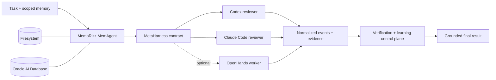

# Evaluating MemoRizz as a memory-first MetaHarness

**Filesystem and Oracle AI Database provider comparison — 22 August 2026**

This report is for AI engineers, forward-deployed engineers, AI solution
architects, and platform teams deciding whether a single coding harness or a
memory-first panel is the right execution topology for a task.

The short result: the **MemoRizz Panel (Filesystem)** was the best-balanced arm
in this small evaluation. It scored **97.5/100**, completed in **43.9 seconds**,
and cost **$0.0623 per task** on average. Compared with Claude Code alone, it
gave up 2.5 judged-quality points while reducing mean latency by **46.2%** and
mean cost by **50.6%**. The **Oracle AI Database** panel completed with full
operational, verification, and grounding parity, but this two-repeat sample is
too small to infer a database-caused quality difference.

> This is a controlled engineering evaluation, not a public benchmark or a
> statistically powered leaderboard result. Two repeats on one synthetic task
> are useful for finding regressions and making the next engineering decision;
> they are not enough to estimate population performance.

## What is a harness?

An agent harness is the execution system around a model. It turns a task into a
bounded, observable run by owning concerns such as:

- workspace and tool access;
- model and runtime selection;
- permissions, network policy, and human approval;
- token, cost, step, and wall-time budgets;
- memory retrieval and context assembly;
- event capture, retries, cancellation, and resumability;
- verification and durable artifacts.

The harness is therefore not the model. A capable model without a reliable
harness is still missing the operational contract required to run production
work safely and repeatedly.

## How MemoRizz is both a harness and a MetaHarness

MemoRizz is a **harness** when a `MemAgent` owns the turn directly: it combines
an LLM provider with scoped memory, retrieval, semantic caching, tools, MCP,
sandboxes, browser control, durable approvals, orchestration, observability,
and continual-learning controls.

MemoRizz is a **MetaHarness** when it delegates work to another complete agent
harness—such as Codex, Claude Code, OpenHands, or another saved MemAgent—through
one normalized task, permissions, budget, memory, event, and result contract.
The same MemAgent can coordinate several harness-backed delegates and merge
their evidence into one answer.



The important architectural property is provider substitution. The two panel
arms used the same agents, prompts, models, workspace, permissions, budgets,
verification, and coordinator. Only the memory provider changed.

## Evaluated systems

| Arm | Execution topology | Memory provider |
|---|---|---|
| Codex only | One Codex CLI run | Filesystem |
| Claude Code only | One Claude Code run | Filesystem |
| MemoRizz Panel (Filesystem) | Codex policy reviewer + Claude verification reviewer + MemoRizz coordinator | Filesystem |
| MemoRizz Panel (Oracle AI Database) | Identical two-reviewer panel and coordinator | Oracle AI Database |

The standalone arms also received their requirements through MemoRizz's scoped
memory context. This preserved grounding parity without introducing Oracle as a
second variable into the standalone baselines. The provider-focused contrast is
the Filesystem panel versus the otherwise identical Oracle panel.

## Task and scoring

Each arm reviewed the same read-only `access_policy.py` and `verify.py` fixture
against the same retrieved export-policy requirements. The fixture contained
six gold findings:

1. expiry checked after authorization grants;
2. an invalid auditor export bypass;
3. case-insensitive comparison of opaque owner IDs;
4. a naive-versus-aware datetime failure;
5. verification through bare `assert`, which disappears under `python -O`;
6. the corresponding missing security test matrix.

A GPT-4.1 judge scored correctness (35), gold coverage (30), evidence (15),
actionability (10), and grounding (10). Candidate names, source UUIDs, and
workspace paths were hidden from the judge. Unsupported claims were recorded
explicitly.

The host verifier ran `python -B verify.py` after every harness execution. Its
100% pass rate means the execution contract completed and the fixture remained
valid; it does **not** mean every reviewer found every latent defect. That is why
the independent gold-and-judge layer is necessary.

## Fairness controls

| Potential confounder | Control used |
|---|---|
| Different code or requirements | One generated workspace and one six-finding rubric |
| Stale memory or cache leakage | New memory ID and source record for every arm/repeat under explicit user and thread scope |
| Provider mismatch inside the panel | Panel construction was identical except for `FileSystemProvider` versus `OracleProvider` |
| Execution-order effects | One seeded random order followed by its exact reverse; every arm's mean position was 2.5 |
| Judge identity bias | All four answers were scored together under randomized opaque candidate IDs |
| Workspace side effects | Read-only workspace, no network, no MCP, no file modification |
| Unequal verification | Identical command, timeout, and verification requirement |
| Silent operational failure | Required succeeded status, grounding, verification, panel synthesis, and zero workflow failures |
| Old Oracle records | Unique scopes plus transactional scoped cleanup after the run |
| Hidden pricing assumptions | Claude cost was CLI-reported; OpenAI components used a dated, published API-equivalent price snapshot |

The comparison is fair at the **system** level, not at the raw-model level. The
panel intentionally used narrow role prompts and lower output ceilings, while
the standalone harnesses were allowed a larger ceiling to avoid truncating a
baseline. Those routing and budget choices are part of the MemoRizz treatment.
They should not be interpreted as an equal-token comparison of model quality.

## Models, budgets, and environment

- Codex: `gpt-5.6-luna`, Codex CLI 0.149.0.
- Claude Code: `sonnet`, Claude Code 2.1.202.
- MemoRizz coordinator: `gpt-5.6-luna`, 1,600 completion-token ceiling.
- Judge: `gpt-4.1`, JSON response, temperature 0.
- Repeats: 2; seed: `20260822`.
- Standalone output ceiling: 18,000 tokens.
- Panel ceilings: 5,000 Codex + 4,000 Claude + 1,600 coordinator tokens.
- All harness runs: no network, no MCP, read-only workspace.
- Oracle: Oracle AI Database 26ai Free, `version_full=23.26.0.0.0`, PDB
  `READ WRITE`, 384-dimensional vector columns, lazy index policy, exact-search
  fallback, and no preflight diagnostics.

OpenAI component costs use the 22 August 2026 price snapshot captured by the
runner: GPT-5.6 Luna at $0.20/M input, $0.02/M cached input, and $1.20/M output;
GPT-4.1 at $2/M input, $0.50/M cached input, and $8/M output. See the official
[GPT-5.6 Luna](https://developers.openai.com/api/docs/models/gpt-5.6-luna) and
[GPT-4.1](https://developers.openai.com/api/docs/models/gpt-4.1) model pages.
Codex CLI did not report dollar cost, so its rows are API-equivalent estimates
from captured usage rather than invoice reconciliation.

## Results

All eight arm executions succeeded, were grounded in the expected memory
source, passed host verification, and produced zero judge-identified unsupported
claims.

| System | Judge score, mean ± SD | Gold findings | Run latency, mean ± SD | Memory seed | Cost/task, mean ± SD | Normalized input | Output |
|---|---:|---:|---:|---:|---:|---:|---:|
| Codex only | 84.5 ± 0.7 | 5.0/6 | 48.7 ± 11.7 s | ~0 s | $0.0068 ± $0.0011 | 64,847 | 2,183 |
| Claude Code only | **100.0 ± 0.0** | **6.0/6** | 81.5 ± 39.4 s | ~0 s | $0.1261 ± $0.0598 | 4,342 | 7,682 |
| **MemoRizz Panel (Filesystem)** | **97.5 ± 2.1** | **6.0/6** | **43.9 ± 6.5 s** | ~0 s | **$0.0623 ± $0.0095** | 57,944 | 5,182 |
| MemoRizz Panel (Oracle AI Database) | 93.5 ± 3.5 | 5.5/6 | 46.9 ± 7.0 s | 1.94 s | $0.0549 ± $0.0028 | 44,653 | 4,270 |

“Normalized input” includes cache-read and cache-creation input where the CLI
reported those fields. Judge overhead is excluded from per-arm cost. The two
judge calls cost $0.027908; arm execution cost $0.500345; total measured
evaluation cost was **$0.528253**.

### Relative comparisons

| Comparison | Quality | Run latency | Cost |
|---|---:|---:|---:|
| Filesystem panel vs Claude only | -2.5 points | **46.2% lower** | **50.6% lower** |
| Oracle panel vs Claude only | -6.5 points | **42.4% lower** | **56.5% lower** |
| Filesystem panel vs Codex only | **+13.0 points** | **10.0% lower** | 9.12× higher |
| Oracle panel vs Codex only | **+9.0 points** | **3.8% lower** | 8.03× higher |
| Oracle panel vs Filesystem panel | -4.0 points | 6.9% higher | 12.0% lower |

The Oracle run-latency column excludes seeding so it measures the same execution
window as the other arms. Including mean seeding, Oracle's panel path was 48.8
seconds versus 43.9 seconds for Filesystem. Oracle's first seed took 3.813
seconds and the second took 0.062 seconds, showing a material cold-start effect.

The Oracle panel's lower model cost and token count should **not** be credited to
Oracle based on this run. Both panel providers delivered the same 516 mean
memory-context tokens and one shared-context reuse; generation remains
stochastic. Two observations cannot separate provider effects from response
length variance. What the run does establish is operational provider parity:
preflight, scoped retrieval, provenance, orchestration, learning events,
verification, and cleanup all worked against the local Oracle database.

## Why the panel costs more than Codex alone

The panel buys independent review and synthesis:

```text
Codex policy review ─┐
                     ├─> evidence-preserving coordinator ─> final answer
Claude test review ──┘
```

That means two external harness calls plus one coordinator call rather than one
Codex call. Claude Code was the dominant panel expense:

| Panel | Claude share | Codex share | Coordinator share |
|---|---:|---:|---:|
| Filesystem | 89.1% | 9.1% | 1.9% |
| Oracle | 86.1% | 11.6% | 2.3% |

The extra spend produced a meaningful result: both panels beat Codex alone by
9–13 judged points, and the Filesystem panel recovered the bare-assert defect
that Codex missed in both repeats. The same panel remained roughly half the cost
of unconstrained Claude alone because the Claude delegate had a narrow task and
a 4,000-token ceiling.

## Memory-first behavior exercised

The cold-run profile used only memory behavior that could be applied without
contaminating the comparison:

- tenant-, memory-, and thread-scoped durable requirements;
- provenance-preserving semantic retrieval;
- one bounded shared evidence pack reused across both delegates;
- exact source-grounding validation for every harness result;
- immutable run, workflow, outcome, and evidence-pack learning events;
- configured retention/forgetting policy;
- provider-aware observability and transactional Oracle cleanup.

Semantic response caching, in-turn summarization, compaction, forgetting
execution, and workflow-to-skill promotion were deliberately not activated.
Each arm was a fresh one-turn scope, so those features either had no valid
history to operate on or would have given the panel prior-answer leakage. A
separate warm/longitudinal benchmark should measure them; turning them on here
would make the cold comparison less fair, not more memory-first.

## SDK shape used by the panel

The executable evaluator contains the full configuration. The essential SDK
shape is:

```python
from memorizz import MemAgentBuilder
from memorizz.metaharness import MetaHarness
from memorizz.memory_provider.filesystem import FileSystemConfig, FileSystemProvider
from memorizz.memory_provider.oracle import OracleProvider

# Substitute only this provider to compare the two panel arms.
provider = FileSystemProvider(
    FileSystemConfig(root_path="./var/memorizz")
)
# provider = OracleProvider.from_env(
#     provision_if_missing=False,
#     index_policy="lazy",
# )

meta = MetaHarness.from_env(
    memory_provider=provider,
    allowed_workspace_roots=[workspace],
)

codex_reviewer = (
    MemAgentBuilder()
    .with_memory_provider(provider)
    .with_execution_harness(
        "codex",
        meta_harness=meta,
        config={"model": "gpt-5.6-luna", "workspace": workspace},
    )
    .build(validate=False)
)

claude_reviewer = (
    MemAgentBuilder()
    .with_memory_provider(provider)
    .with_execution_harness(
        "claude-code",
        meta_harness=meta,
        config={"model": "sonnet", "workspace": workspace},
    )
    .build(validate=False)
)

coordinator = (
    MemAgentBuilder()
    .with_memory_provider(provider)
    .with_learning_control_plane(True)
    .with_delegation(
        [codex_reviewer, claude_reviewer],
        enabled=True,
        mode="deterministic",
        plan=review_plan,
        evidence_context=True,
        return_report=True,
    )
    .build(validate=False)
)

report = coordinator.run(
    task,
    memory_id=memory_id,
    user_id=user_id,
    thread_id=thread_id,
)
```

For production code, also pass the full `HarnessPermissions`, `HarnessBudget`,
`VerificationSpec`, durable run store, and approval store shown in the evaluator.

## Reproduce the evaluation

Run preflight without spending model tokens:

```bash
PYTHONPATH=src .venv/bin/python \
  eval/metaharness/provider_comparison.py \
  --repeats 2 \
  --seed 20260822 \
  --output /tmp/memorizz-provider-comparison-dry-run.json
```

Run the paid evaluation only after both harness probes and Oracle preflight pass:

```bash
PYTHONPATH=src .venv/bin/python \
  eval/metaharness/provider_comparison.py \
  --execute \
  --repeats 2 \
  --seed 20260822 \
  --output /tmp/memorizz-provider-comparison.json
```

Credentials are loaded from the process environment; they are never CLI
arguments or report content. The runner redacts its artifact and always closes
services, providers, and agent lifecycles in a `finally` block.

## Recommended MemoRizz improvements

### P0 — improve quality per dollar

1. **Coverage-aware structured consolidation.** Have each reviewer return
   typed findings with requirement IDs, evidence spans, severity, and proposed
   tests. The coordinator should compute a deterministic union before prose
   synthesis and fail its completion gate if synthesis drops a covered
   requirement. This directly targets the Oracle repeat that lost G5.

2. **Adaptive reviewer escalation.** Run the lower-cost Codex reviewer first,
   score coverage and uncertainty against explicit policy dimensions, and call
   Claude only for uncovered or high-risk dimensions. Claude currently accounts
   for 86–89% of panel cost. A criterion-aware cascade can retain panel quality
   without paying for a full second review on every easy task.

3. **First-class phase telemetry.** Record provider connect, seed, retrieval,
   context assembly, queue, harness execution, verification, synthesis, and
   persistence separately. Add a normalized context-content fingerprint so
   provider comparisons can prove that delegates saw byte-equivalent evidence.

### P1 — reduce latency and operational write amplification

4. **Ephemeral-agent execution mode.** The Oracle cleanup found 45 Toolbox rows
   and 32 shared-memory rows for three temporary panel agents. Evaluation and
   short-lived FDE workflows should be able to avoid persisting unused default
   tools and agent metadata while retaining run evidence.

5. **Warm Oracle connections and batch setup.** Reuse a validated pool, batch
   participant/tool registration, and publish cold versus warm provider latency.
   The observed 3.813-second first seed versus 0.062-second second seed shows why
   a single blended latency number is insufficient.

6. **Minimal external-harness profiles.** Codex processed 36k–79k normalized
   input tokens per run despite receiving only 172 memory-context tokens.
   Measure the CLI bootstrap/system-context contribution, disable unused tool
   surfaces, and support a compact review profile. Progressive tool disclosure
   should cover external harness adapters as well as native MemAgent tools.

### P1 — strengthen evaluation and continual learning

7. **Add a separate warm-memory protocol.** Measure first turn, exact repeat,
   semantic repeat, post-summary repeat, stale-domain invalidation, compaction,
   forgetting, and verified workflow-to-skill promotion for both Filesystem and
   Oracle. Report accuracy and provenance before claiming cache savings.

8. **Promote only verified reviewer strategies.** Store which reviewer found
   each requirement, consolidation losses, verifier outcomes, judge feedback,
   and cost. Promote a routing or review workflow only after repeated shadow
   wins, and preserve the instruction hierarchy when compiling it into a skill.

9. **Expand statistical coverage.** Use at least 10–20 fixtures across security,
   debugging, implementation, and repository navigation; increase repeats;
   pin model snapshots; report bootstrap confidence intervals; and add a second
   blinded judge or human adjudication for close results.

10. **Make result artifacts release-grade.** Persist source commit plus patch
    identity, provider and container versions, pricing snapshot, model snapshot,
    harness version, context fingerprints, failures in the denominator, and a
    secret-scan result. This run recorded most of these, but used a dirty source
    worktree and the mutable `sonnet` alias.

## Decision guide

| Requirement | Recommended topology from this run |
|---|---|
| Lowest cost, acceptable review recall | Codex only |
| Maximum quality regardless of time/cost | Claude Code only |
| Best observed balance of quality, latency, and cost | MemoRizz Panel (Filesystem) |
| Durable enterprise memory, SQL governance, and provider parity | MemoRizz Panel (Oracle), after cold-start tuning and a larger validation set |
| Repeated similar workloads | Run the separate warm-memory protocol before selecting a cache policy |

The platform-level conclusion is not that “more agents always win.” It is that a
memory-first MetaHarness makes the trade-off explicit and governable: select a
topology per risk, share only bounded grounded context, verify the result, learn
from outcomes, and preserve enough telemetry to change the routing policy when
the evidence changes.

## Evidence and limitations

- Executable runner: [`../metaharness/provider_comparison.py`](../metaharness/provider_comparison.py)
- Sanitized summary: [`2026-08-22-metaharness-provider-comparison.json`](2026-08-22-metaharness-provider-comparison.json)
- Full local artifact: `/private/tmp/memorizz-provider-comparison-20260822.json`
- Full-artifact SHA-256: `fa2d8039c0cceaf444190480e13b35c0e76ae2177a8e9abdc644902687de2356`
- Source base: `e08a90e72ca0b618013ad728cb0bdbd2515397f7` plus uncommitted local changes.
- Credential-pattern scan: passed; no raw credentials are included.
- Primary limitation: one synthetic fixture, two repeats, one judge model, and
  stochastic model responses.

Treat these numbers as an auditable baseline for the next iteration, not as a
general claim about Codex, Claude Code, Filesystem, Oracle, or MemoRizz.
