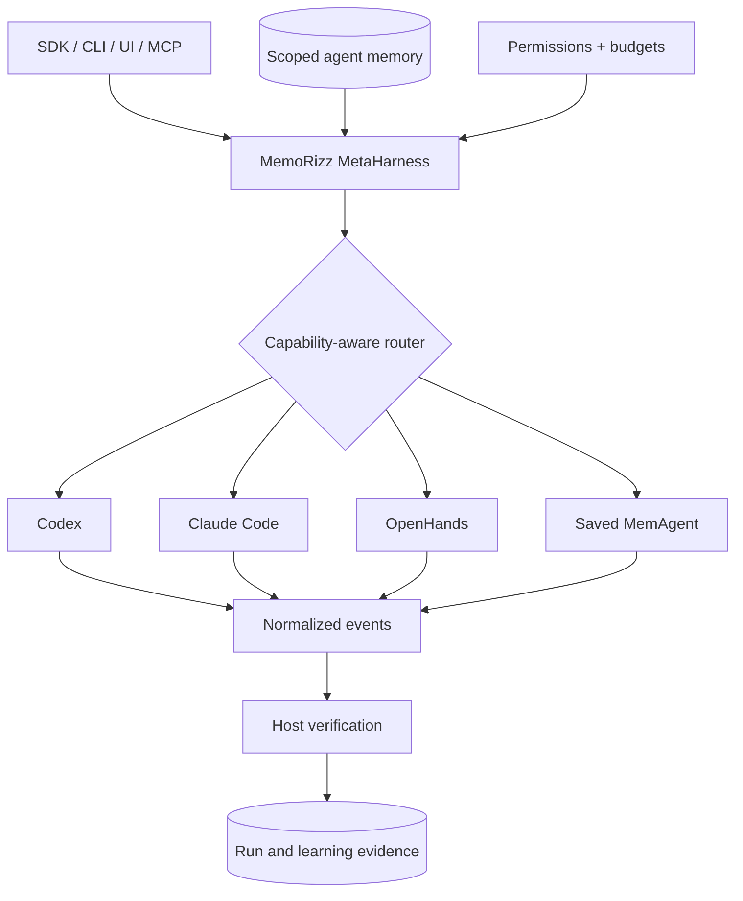
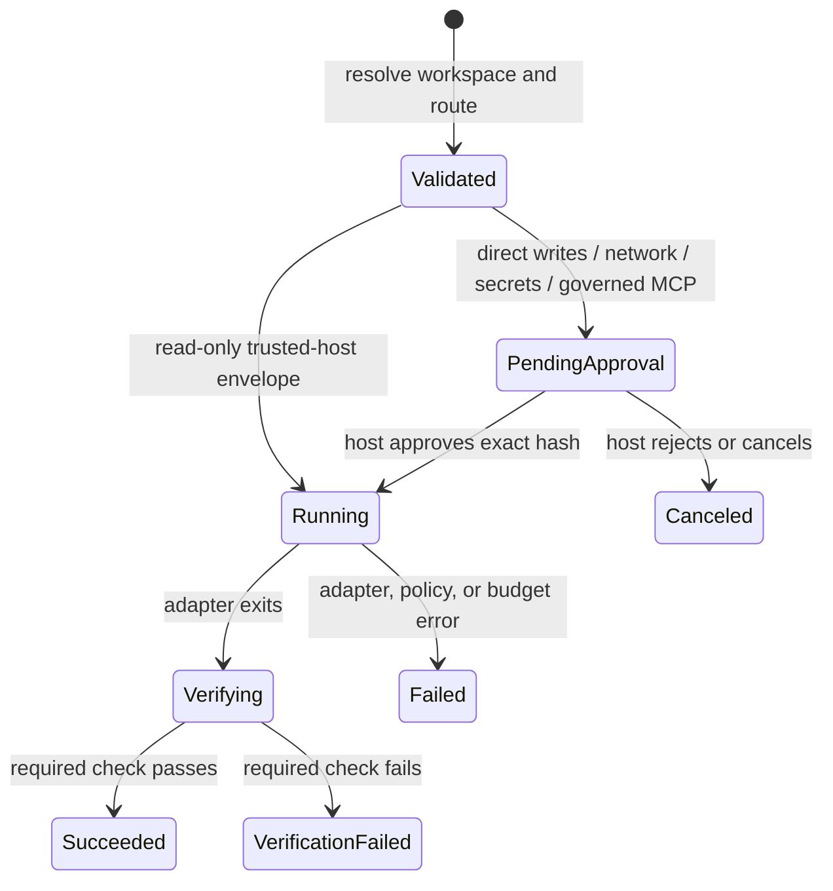

# MemoRizz MetaHarness Learning Path

This example series explains how MemoRizz can govern several agent harnesses
through one memory-first control plane. It starts with deterministic local
adapters, so you can inspect every contract without credentials or model cost,
then progresses to Codex, Claude Code, and OpenHands.

## What is a meta-harness?

A harness owns an agent's execution loop: it reads a task, uses tools, inspects a
workspace, and returns a result. A **meta-harness** places one stable operational
contract around multiple harnesses. MemoRizz adds scoped memory, deterministic
routing, exact approvals, durable events, host-side verification, observability,
and evidence suitable for continual learning.



## Notebooks

| Notebook | What you will learn | External model call? |
|---|---|---|
| [01 — Offline quickstart](01_metaharness_quickstart.ipynb) | The task envelope, scoped memory context, adapter contract, normalized events, verification, and durable run ledger | No |
| [02 — Durable approvals and operations](02_durable_approvals_and_operations.ipynb) | Exact single-use approvals, workspace fingerprinting, resume, tamper detection, cancellation, and audit evidence | No |
| [03 — MemAgent and vendor harnesses](03_memagent_and_vendor_harnesses.ipynb) | Adapter discovery, `runtime` versus `delegate` mode, safe opt-in execution, and SDK/CLI/UI/MCP parity | Only when explicitly enabled |
| [04 — Multi-harness review team](04_multi_harness_review_team.ipynb) | A deterministic MemAgent multi-agent system with a Codex correctness analyst and an independent Claude Code adversarial reviewer | Only when explicitly enabled |
| [05 — Adaptive provider comparison](05_single_vs_multi_harness_evaluation.ipynb) | Audit the historical `structured_adaptive_v1` protocol, its Filesystem/Oracle artifact, fairness controls, and the narrow early-stopping claim it supports | No by default; paid rerun is explicit |
| [06 — Factorial and Opus 5 evaluation](06_fair_harness_comparison_results.ipynb) | Build direct MetaHarness, one-harness MemAgent, mandatory and adaptive panels; audit the Filesystem/Oracle factorial; then reconstruct a four-task GPT-5.6 Luna versus Claude Opus 5 comparison from task-native evidence | No by default; paid runs are explicit |

Run them in order. The local adapters in notebooks 1 and 2 are educational test
doubles: they implement the same public `AgentHarness` interface as the vendor
adapters but make no network calls.

Notebook 5 is a historical methodology and artifact audit, not a leaderboard
claim. Its panel rows used adaptive Codex-first execution and each recorded one
harness call. They therefore support an early-stopping observation on the
fixture, not a claim about an executed Codex-plus-Claude panel.

The panel deliberately does not invoke every memory subsystem inside a one-shot
turn. It uses scoped evidence retrieval, stable prompt prefixes, verification,
observability, and learning capture immediately; existing summaries may be
retrieved, while new summarization/compaction and governed forgetting belong
between long-lived runs. Semantic-cache reuse is reserved for a deterministic,
verified, read-only repeat with an explicit repository or data version.

The corrected factorial evaluator creates both Filesystem and Oracle provider
strata in one paired run. Oracle preflight and provider-neutral evidence
fingerprint checks happen before spend; the artifact retains provider labels,
exact call policies, and capability evidence so provider and orchestration
effects cannot be silently pooled.

Notebook 06 constructs the measured topology directly: real Codex and Claude
Code adapters, one-harness runtime MemAgents, and deterministic full/adaptive
root MemAgents with no coordinator model call. Its six strategies over two
providers form 12 arms per repeat. It reinterprets the earlier artifact rather
than manufacturing corrected results, scores paid candidates in separate
identity-blind judge calls, and treats the single fixture—not its reruns—as the
unit of inference. The paid cell runs only after the operator explicitly sets
`MEMORIZZ_RUN_HARNESS_EVALUATION=1`; secrets stay in the process environment and
are never written into the notebook.

Its safe default now loads the completed
[paid factorial report](../../eval/results/2026-08-22-metaharness-factorial-paid.md)
and sanitized JSON artifact without making external calls. All 24 observations
recovered the six required criteria and passed grounding and host verification.
The notebook also explains why the scalar LLM judge is diagnostic-only: its
construct-validity audit found deductions for style and instruction
restatement. Known spend and cost-unknown failed judge attempts remain explicit.

Notebook 06 also opens with the committed Opus 5 small-suite table and rebuilds
it from the sanitized JSON artifact in its final analysis section. The table
includes what each configuration means, exact model IDs and effort, memory
provider, hidden-check accuracy, fully correct tasks, latency, cost, tokens, and
calls. Its `OPUS5_RESULT_REFERENCE` value binds the displayed table to the
artifact path, SHA-256, schema version, and protocol fingerprint.

## Install and launch

From a clean virtual environment:

```bash
python -m pip install -e ".[dev,notebooks]"
python -m jupyter lab examples/metaharness
```

For an installed release rather than a source checkout:

```bash
python -m pip install "memorizz[notebooks]>=0.6.0"
python -m jupyter lab
```

Launch Jupyter with the same `python` used to install MemoRizz. The first code
cell in notebooks 5 and 6 prints `sys.executable`, making an accidentally
selected global kernel visible before any external execution.

Every notebook creates its workspace, SQLite ledgers, and filesystem memory
inside a temporary directory and removes them in its final cell. Re-run the
setup cell if you restart the kernel.

## Safety model used in the examples



Important properties:

- `approved=True` is never exposed to a model. A host approves a durable proposal
  identified by a single-use proposal ID.
- The proposal binds the exact task, arguments, scope, permissions, budget,
  verification command, context fingerprint, and workspace fingerprint.
- MemoRizz resumes the stored checkpoint; it does not ask a model to reconstruct
  approved arguments.
- OpenHands is routed only when the operator supplies an external isolation
  boundary. Its headless auto-approval mode is not treated as a local sandbox.
- A successful harness process is not enough: `HarnessResult.ok` also requires
  any configured host verification to pass.

## Where to go next

- Read the [MetaHarness guide](../../docs/guides/meta-harness.md) for production
  configuration and the full adapter policy matrix.
- Run `memorizz harness doctor` to inspect local adapter readiness.
- Open **Agent Harnesses** in `memorizz ui` to inspect the same durable records.
- Use the MemoRizz MCP tools when another MCP client should launch and observe
  bounded harness runs. Approval decisions intentionally remain host-side.
