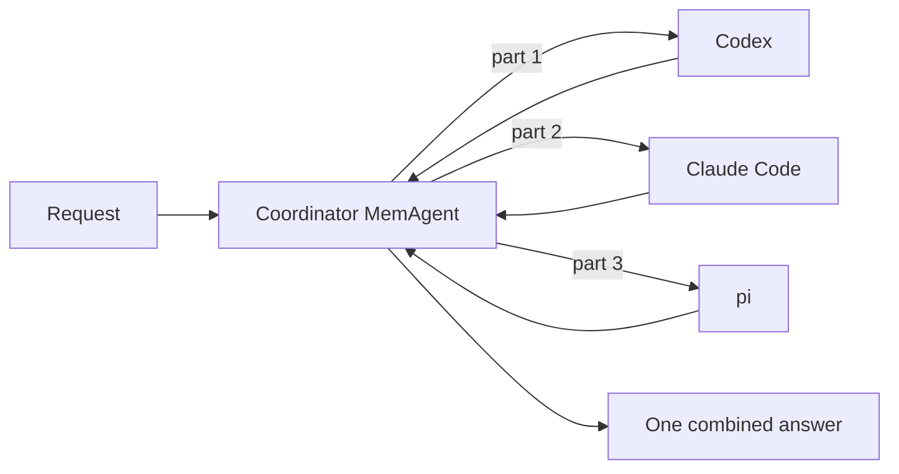

# Harnesses as delegates: two examples

A MemAgent can coordinate other harnesses. Its delegates are saved agents in
**Run complete turns on a harness** mode, so when it splits a request, each part
runs on Codex, Claude Code, pi, Hermes or OpenHands. The parts run at the same
time, and the coordinator combines what comes back.



| Example | Delegates | Workspace | Network |
|---|---|---|---|
| **Code review crew**: find the bugs in a small module, say which tests would catch them, check the docs | Codex bug hunter, Claude Code test designer, pi doc checker | `sample_project/` | None |
| **Research desk**: compare companies on the web, one company per delegate, with sources | Codex researcher, Claude Code researcher | A fresh scratch folder | Full (asks for approval once) |

`sample_project/inventory.py` has four planted problems: selling an unknown
item raises `KeyError` where the README promises `ValueError`, `low_stock`
misses items exactly at the threshold, `order_total` treats `discount=10` as
ten times the total instead of 10%, and `restock` accepts zero or negative
quantities. Its three tests pass without catching any of them.

## Set up

```bash
python examples/metaharness/multi_harness_delegates/setup_examples.py
```

It creates the two coordinators and their delegates in your MemoRizz store
(`~/.memorizz/memory` unless `--memory-root` or `MEMORIZZ_MEMORY_ROOT` says
otherwise), with the coordinators on `anthropic/claude-sonnet-5-5`
(`--coordinator-model` to change it). Running it again reuses what it created.
Restart `memorizz ui` afterwards so it lists the new agents.

You need Codex signed in (`codex login`), `ANTHROPIC_API_KEY` for the
coordinators, Claude Code and pi, and pi installed
(`npm install -g --ignore-scripts @earendil-works/pi-coding-agent`).

## Run in the UI

On **Agent Harnesses**, open **More launch options** and choose **Single run**:

1. **Harness:** `memagent`. **Saved MemAgent:** *Code review crew*.
2. **Workspace:** the full path of `sample_project/`.
3. **Task:** *Review this project: find the bugs in inventory.py, say which
   tests would catch them, and check README.md against the code.*
4. Start the run, select it in the ledger and watch its trajectory: each
   delegate appears as a subagent with **Open its codex run** (or claude-code,
   pi). Their own runs sit in the ledger tagged **Delegate**.

For the **Research desk**, leave the workspace blank, set **Network** to
**Full · web access**, and ask *Compare Oracle, Microsoft and Alphabet: latest
share price, change over the past month, and one headline from this week, each
with a source.* The run asks for approval once and the delegates share it:
they work in the run's folder with its network access, and they may edit
files only when the run was approved for edits (**Allow direct workspace
edits**). Delegates that edit take turns in the folder. **Cancel run** stops
the coordinator and every delegate run it started.

You can also chat with either coordinator in the playground. Its inspector
(Overview tab) has a **Harness delegates** card: by default each conversation's
delegates get a fresh folder and no web access. For the code review crew, put
the full path of `sample_project/` in **Folder** and press **Allow**. For the
Research desk, choose **Full · web access**, give your name and press
**Allow**; the grant lasts eight hours and every message in that conversation
uses it.

## Harness delegates or model delegates

A harness delegate brings that harness's own loop, tools and sandbox (Codex's
shell, Claude Code's file and web tools), which suits code and workspace work.
A plain MemAgent delegate on another model shares MemoRizz's tools, memory and
policies and runs in process, which suits research, writing and analysis. A
coordinator can mix both: tick ordinary agents in its **Delegates** section
next to the harness ones.

## Cost

Each delegate is a separate model session. The coordinator plans and writes the
answer (a planning call and a writing call on `claude-sonnet-5-5`), Claude Code
and pi bill your Anthropic key, and Codex bills your ChatGPT plan.

What the test runs cost:

| Example | Anthropic (Claude Code, pi) | Codex, list-price estimate |
|---|---|---|
| Code review crew | about $0.06 | about $0.28 |
| Research desk | about $0.19 | about $1.90 (two Codex runs) |

The coordinator's two calls come on top. Web research costs more than code
review because the delegates read many pages. If Codex is on a ChatGPT plan,
its figure is what the tokens would cost at API prices; the plan's usage limits
apply rather than a bill. Each delegate's run in the ledger shows its own cost.
