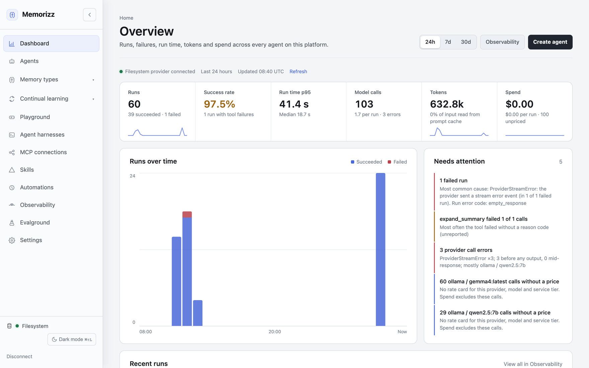
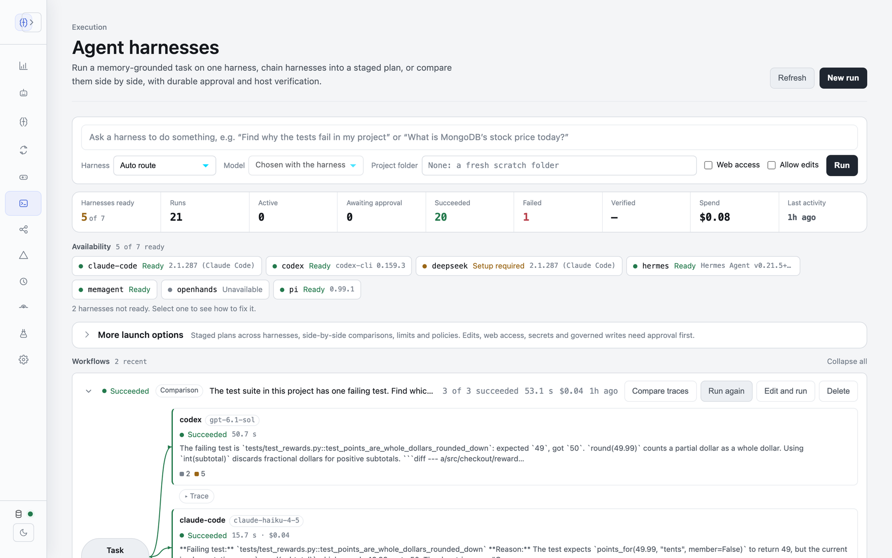

# MemoRizz local UI

A FastAPI + Jinja console for MemoRizz: agents and their playground, every
memory type, traces and usage, continual learning, automations, MCP
connections, Evalground and agent harnesses.

```bash
pip install "memorizz[ui]"
memorizz ui            # http://127.0.0.1:8765
```

<picture>
  <source media="(prefers-color-scheme: dark)" srcset="../../../docs/assets/screenshots/dashboard-dark.png">
  
</picture>

<picture>
  <source media="(prefers-color-scheme: dark)" srcset="../../../docs/assets/screenshots/harnesses-dark.png">
  
</picture>

The agent dashboard (top) and the harness dashboard (bottom).

Connect to a FileSystem, MongoDB, Oracle or Notion memory provider from the
connect page. The user guide is `docs/getting-started/local-ui.md`; tracing
and the observability pages are covered in `docs/observability-ui.md`.

## Layout

- `app.py` builds the application and registers the routers in `routers/`.
- `templates/` holds the pages; `_ui.html` and the other `_*.html` files are
  shared macros. `static/css/console.css` and `static/js/monitor.js` provide
  the shared monitor layout; page-specific styles live in `static/css/pages/`.
- `*_view.py`, `dashboard.py` and the `*_monitor.py` modules shape store
  records into what a page shows, without extra reads.
- `state.py` holds the connected provider and shared services;
  `security.py` holds authentication, read-only mode and trace redaction.

## Security

The UI binds to 127.0.0.1 by default. Before exposing it beyond one machine,
set `MEMORIZZ_UI_AUTH_TOKEN` (or `MEMORIZZ_UI_AUTH_ACCOUNTS`). Set
`MEMORIZZ_UI_READ_ONLY=true` to refuse every change, including harness
launches and approvals.
